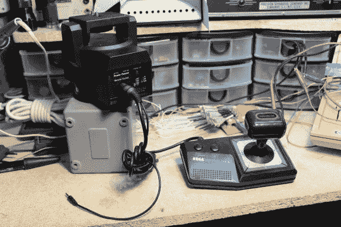

# 游戏控制器改作跳蚤市场寻找

> 原文：<https://hackaday.com/2013/09/30/game-controller-repurposed-for-flea-market-find/>

三脚架上不协调的云台可能会破坏你的电影镜头，向上或向下倾斜通常需要一些放松和收紧的功夫，以防止重力接管。“动力摇摄器”是一个遥控装置，安装在三脚架和相机之间，轻松处理平移和倾斜。当[NeXT]在国会跳蚤市场以 5 美元的价格找到一个时，他并不在乎丢失的遥控器。他买了摇床，把它拖回家，用世嘉的主键盘组装了他自己的遥控器。

在网上研究了类似的设备后，[NeXT]确定了原始遥控器的引脚排列:本质上是一个可调节速度控制的 D-pad。他决定忽略速度引脚，而是寻找合适的替代控制器。世嘉主焊盘提供了最简单的解决方案，因此[NeXT]开始将电线分离出来，并焊接到 DIN 连接器上。他找不到合适的插头来配合淘洗者的 DIN-7 插孔，所以他用折断的额外引脚替换了 DIN-8。

[NeXT]没有使用剩下的两个按钮来控制速度，而是选择直接将它们接入他的相机来驱动对焦和快门，但主面板的布线带来了一个问题:相机必须共享电动摇摄器的接地，摇摄器通过 6V 适配器插入墙壁。十指交叉，他决定向前推进，并因一切正常而松了一口气。我们怀疑，只要一个设备使用[浮动电源](http://forum.allaboutcircuits.com/showthread.php?t=10345)，共享接地就不会有问题，该设备可以通过适当的壁式电源或使用其 4 节 AA 电池选项来提供。

如果你想了解更多的相机技术，看看上周的[隔音和防水设计](http://hackaday.com/2013/09/23/sound-blimp-makes-camera-quieter-and-waterproof/)。