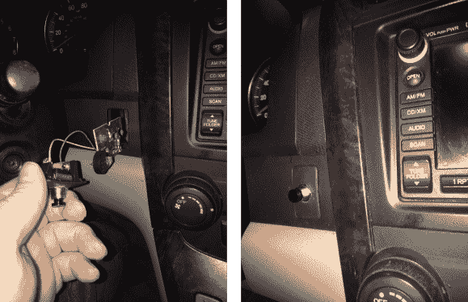

# 车库遥控器仪表板集成

> 原文：<https://hackaday.com/2014/02/15/garage-clicker-dashboard-integration/>

具有最高等级装饰套装的车辆有时能够学习车库门遥控接收器代码。价格较低的产品缺乏这一功能，也没有其他的花哨功能，只留下了原本有花哨按钮的空白盘子。[JiggMcFigg]充分利用了这种情况，把他的车库遥控器掏空[藏在一个空白按钮](http://www.instructables.com/id/How-to-install-a-Garage-Door-opener-in-a-dashboard/)后面。

令人惊讶的是，在左图所示的尺寸检查图片上，你可以看到硬币电池盒。但实际上，这些遥控器的电池消耗率几乎与未使用的电池相同，所以为什么要让黑客攻击变得复杂呢？一个支架焊接到板上，跳线焊接到添加到空白板上的按钮上。无论如何，这种实用的纽扣比那些花里胡哨的丝印模塑料纽扣更令人满意！

当然，您可以通过这种方式进行其他操作。[JiggMcFigg]一开始就有在汽车的混乱中丢失遥控器的问题。你可以用一个大按钮来改装它，让它更难放错位置。