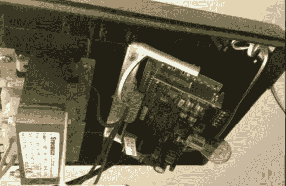

# 使用 Siri 和 Raspberry Pi 的车库门开启器

> 原文：<https://hackaday.com/2012/12/11/garage-door-opener-using-siri-and-raspberry-pi/>

[DarkTherapy]来信告诉我们他的车库开门器与 Siri 和树莓派配合使用。很难找到讲述黑客故事的图片，但在这里你可以看到车库开门器外壳内的 PCB。他把灰色的电线接入接线板。在另一端，他们连接到一个继电器，使连接。

机械继电器的控制端是一个覆盆子 Pi 板。这看起来有点过了，但请记住 RPi 的低成本和通过网络通信的能力，这要归功于它使用的 WiFi 加密狗。我们认为这比把一部安卓手机绑在开瓶器上没有那么离谱。为了让 RPi 和 Siri 一起工作，他选择了 SiriProxy 包。[我们之前见过这个软件](http://hackaday.com/2011/11/30/siri-as-a-lippy-and-sometimes-profane-television-remote/)，但是不记得它和树莓派一起使用过。

像这样的系统当然有扩展功能的空间。增加一个像[这样的密码锁是微不足道的，我们用 AVR 芯片](http://hackaday.com/2010/08/02/doorbell-combo-lock-can-open-your-garage-door/)制造了这个密码锁。如果能看到一个用来确认门是否关闭的传感器就更好了。即使你不需要控制你的车库，这也是一个很好的参考项目，可以让 RPi 从你的 iOS 设备上接受命令。

[https://www.youtube.com/embed/NUJ5z76Xv5o?version=3&rel=1&showsearch=0&showinfo=1&iv_load_policy=1&fs=1&hl=en-US&autohide=2&wmode=transparent](https://www.youtube.com/embed/NUJ5z76Xv5o?version=3&rel=1&showsearch=0&showinfo=1&iv_load_policy=1&fs=1&hl=en-US&autohide=2&wmode=transparent)