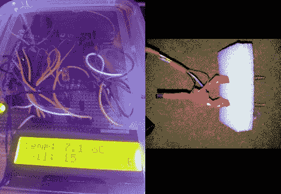

# 花园传感器测量土壤湿度和温室温度

> 原文：<https://hackaday.com/2012/05/14/garden-sensors-measure-soil-moisture-and-greenhouse-temperature/>

[安迪]正在整理他的花园。今年天气相当冷，所以他决定弄一个小的塑料圆顶隧道，作为一个迷你温室。为了帮助监测环境，他建造了这个传感器阵列，显示温度和土壤湿度读数。

温度很简单。他使用的是一个 TMP36 传感器，放在离地面几英寸的地方。湿度传感器是他自己设计的。它使用嵌入泡沫中的两个建筑螺钉。这些被推入土壤，电阻读数显示水分水平。通过在一个螺丝上施加电压，测量另一个螺丝上的电压，他得到了一些有用的数据。这不是一个标准值，但是随着时间的推移，观察会让他知道刻度与干燥或潮湿土壤的关系。

在构建过程中，他发现需要在用于测量湿度的探针上安装一个下拉电阻。他还使用一个 I/O 引脚来驱动另一个螺杆。这给了他一个在不阅读时切断电源的方法。我们只是希望他要么有一个限流电阻，要么使用晶体管来驱动它。