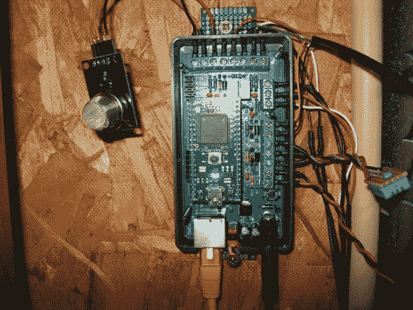

# 煤气、水和电监控

> 原文：<https://hackaday.com/2013/07/13/gas-water-and-electricity-monitoring/>

从这个样子你可以看出[贾斯珀·西肯]有一些非常有趣的东西在监控他家里的公用设施。但需要注意的是，这是出租屋。因此，给煤气表、水表和电表添加传感器必须在不做任何永久性改变的情况下完成。

上面的模块是他自己的基本 PCB，它接受 mbed 板来收集和报告使用情况。他的电表有一个发光二极管，每用一瓦特就会闪烁一次。他用一个光敏电阻来监测，设计了一个巧妙的方法，用四块磁铁把它固定在仪表上。水表有一个圆盘，每通过一升水，圆盘旋转一周。圆盘的一半是反射性的，所以他用一个光反射传感器来跟踪它。最后，煤气表的一个轮子上有一个反光数字。每次这个数字经过时，传感器都会跟踪，表示使用了 10 升汽油。他还监测温度，我们确信这在试图理解数据时会派上用场。

[谢谢斯蒂芬]