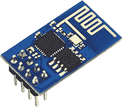

# ESP8266 WiFi 模块的 GCC

> 原文：<https://hackaday.com/2014/10/02/gcc-for-the-esp8266-wifi-module/>

几周前，当我们第一次听说 ESP8266 UART 转 WiFi 模块时，我们就知道它是一个特殊的模块。它很便宜，让每个微控制器都能够连接到 WiFi 网络，并且可以——可能——自行编程，将这个小模块变成一个完整的物联网解决方案。阻止最后一个特性实现的唯一原因是缺少编译器支持。这种情况现在已经改变了。官方非官方的 ESP8266 社区论坛[现在有一个为 ESP8266](http://www.esp8266.com/viewtopic.php?f=9&t=224) 工作的 GCC。

大多数人从中国购买的 ESP8266 采用了 Tensilica Xtensa LX3 32 位 SOC，主频为 80 MHz。板上有一个 SPI 闪存，包含几十千字节的数据。当然，其中大部分是运行 TCP/IP 协议栈和管理无线电的代码。还剩下几 k——和几个引脚——任何人都可以向这个模块添加一些代码和一些扩展功能。对于这个模块的 GCC 工作，只需要几天时间，就会有人设法在这个模块上运行最基本的项目。到下周，有人会有一个这个模块连接到电池的视频，有一个可以上网的闪烁 led。

当然，这不是这个模块唯一能做的事情；价格不到 5 美元，传感器接入、代码编写和真正负担得起的物联网传感器平台的创建只是时间问题。

如果你有一些这样的模块，并且你想尝试一下新的编译器，[git 就在这里](https://github.com/jcmvbkbc/gcc-xtensa)。