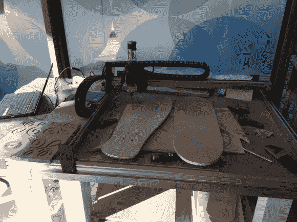

# 通用电气车库和芝加哥创意周

> 原文：<https://hackaday.com/2013/10/12/ge-garage-and-chicago-ideas-week/>

我一直在休假，并设法有一天时间在通用汽车公司车库移动工厂实验室玩，该实验室目前设在芝加哥市中心。通用电气与芝加哥创意周合作，将制造技术的未来带入一个空间，社区可以走出街道，使用一些令人惊叹的硬件，如数控铣床、激光切割机和 3D 打印机。该小组还在特定时间教授使用设备和通用电器的课程。不幸的是，我在 10 月 20 日活动即将结束时在城里。如果你在这个地区，我建议你跳上芝加哥的交通工具，在这个地方玩得开心。这里有更多关于地点、课程和时间的细节。

我并不期望在我的假期中挤出任何工作，但我确实带着我的 iPhone 5s 在导游的带领下参观了 fab 空间。你可以在休息后和我一起观看巡演，虽然有点粗糙，但仍然涵盖了很多有趣的话题。了解他们的产品线或 Replicator 2 3D 打印机。在工业规模的打印机上看到一些由金属制成的奇妙的印刷品。了解更多关于上面看到的切割滑板甲板的放大 CNC。最后用注塑机完成。

[https://www.youtube.com/embed/0eclycpktqw?version=3&rel=1&showsearch=0&showinfo=1&iv_load_policy=1&fs=1&hl=en-US&autohide=2&wmode=transparent](https://www.youtube.com/embed/0eclycpktqw?version=3&rel=1&showsearch=0&showinfo=1&iv_load_policy=1&fs=1&hl=en-US&autohide=2&wmode=transparent)