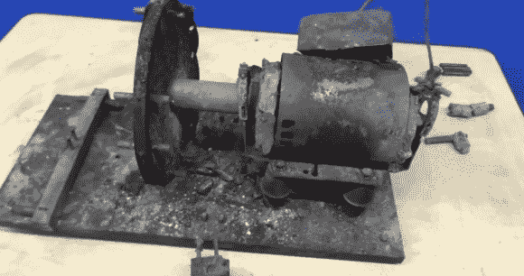

# 极客团火更新

> 原文：<https://hackaday.com/2014/01/06/geek-group-fire-upate/>

极客小组正在清理他们的火灾。他们的小电容器/火花隙房间遭受了最大的破坏，内部几乎完全烧毁，同时墙壁和屋顶也有一些结构性损坏。红色塑料焊接幕将间隙室与大得多的高压实验室隔离开来。窗帘是防火的，但是当它最终燃烧时，它被烟熏得非常黑。随着窗帘燃烧，煤烟覆盖了高压实验室。建筑的其余部分幸免于火灾，但几乎全部被一层薄薄的烟尘覆盖。这个小组已经并且正在用吸尘器、抹布和其他工具来解决煤烟问题。他们的几个赞助商也承诺提供物资来支付修复费用。

[克里斯]和[保罗]也一直在调查火灾的根本原因。尽管毫无疑问，原因永远不会为人所知，但他们对这一系列事件有一个很好的了解。Gemini，该小组的 200 千伏安特斯拉线圈在探测到烟雾之前已经运行了约 1/2 小时。火势集中在双子座的火花隙房间。对旋转火花隙的仔细检查表明，固定电极似乎都受到了机械冲击。看来，当间隙运行时，或者当它旋转时，其中一个飞行电极移动得足以撞击固定电极。这些电极是 3/8″和 1/2″的钨，在间隙工作时经常发出白热的光。一个固定螺钉将每个电极固定在 12”转子中。发现一个浮动电极的固定螺钉松动，其保留的电极可能会影响固定电极。不难猜测，这些撞击产生的热金属可能会落在电容器阵列中，闷烧，并最终着火。

一颗松动的螺丝钉很可能导致了导致火灾的一系列事件。[Chris]和[Paul]观察到火花隙即使在正常运行时也会抛出热金属碎片，并设计了一个封装盒。然而，灾难在它建成之前就降临了。这并不是说极客集团经营的是不安全的店铺。重要的是没有人受伤。大楼里的每个人都被迅速安全地疏散了。

关于评论的一个简短说明——我们知道极客群体和[Chris]往往是两极分化的话题。然而，我们希望的~~尽量保持评论的建设性。~~

[https://www.youtube.com/embed/SaModLpPr38?version=3&rel=1&showsearch=0&showinfo=1&iv_load_policy=1&fs=1&hl=en-US&autohide=2&wmode=transparent](https://www.youtube.com/embed/SaModLpPr38?version=3&rel=1&showsearch=0&showinfo=1&iv_load_policy=1&fs=1&hl=en-US&autohide=2&wmode=transparent)

[https://www.youtube.com/embed/-tTEFTsYLp0?version=3&rel=1&showsearch=0&showinfo=1&iv_load_policy=1&fs=1&hl=en-US&autohide=2&wmode=transparent](https://www.youtube.com/embed/-tTEFTsYLp0?version=3&rel=1&showsearch=0&showinfo=1&iv_load_policy=1&fs=1&hl=en-US&autohide=2&wmode=transparent)