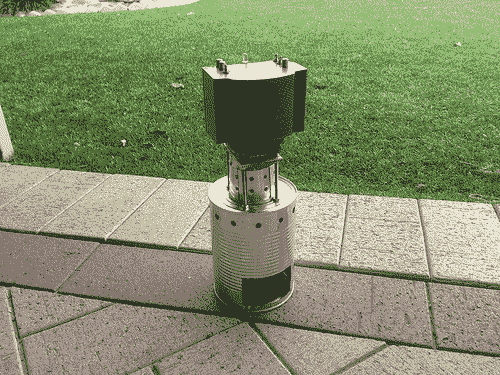

# 用酒精发电

> 原文：<https://hackaday.com/2013/04/12/generating-electricity-from-alcohol/>

这是[x2Jiggy]制造的热电发电机。这个概念利用火焰的热量，通过帕尔贴效应产生电力，这种热量是由建筑顶部的巨大散热器产生的。

该建筑是被动冷却的，使用同步组件，利用热管来帮助增加散热。一个近乎平坦的散热器构成了热面的安装面，面朝下朝向驱动发电机的火焰。[x2Jiggy]通过使用罐子、灯芯和橄榄油作为热源开始了这个项目。他设法用这种方法从系统中取出大约 2V。你在这里看到的是第二个版本。它把橄榄油灯换成了酒精炉。打了孔的罐子可以起到挡风的作用，同时也提供了一个稳定的底座。这种再现产生大约 3V，但它听起来不像有任何精确的测量它在负载下可以做什么。