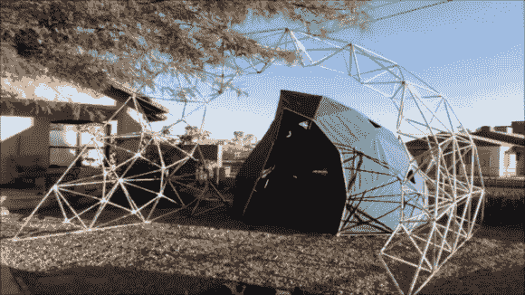

# 不仅仅是圆顶的网格结构

> 原文：<https://hackaday.com/2014/04/11/geodesic-structures-that-arent-just-domes/>

[Brian Korsedal]和他的公司 *Arcology Now！*开发了一个伟大的[短程线建筑系统](http://www.arcologynow.com/#!universal-constructor/c1qrr "Archology Now! Universal Constructor")，它使得建筑结构不仅仅局限于穹顶。他们 3D 扫描地形，生成计划，并制作短程线钢空间框架结构，这些结构易于组装，可以是任何可以想象的形状。

他们聪明的设计软件可以创建任何形状，并将不平坦的地形纳入计划。这些结构很容易用基本的工具来构建，并且组装非常简单，因为[杆标签](http://blog.onlinelabels.com/tag/arcology-now/)是由设计软件生成的。观看这段[施工延时视频](https://www.youtube.com/watch?v=yfxYf57iv6I)。

目前，订购公司制造的结构是你唯一的选择。但是如果你有黑客空间，制作类似的东西应该不会太难。甚至可能值得现在就去接触 *[Arcology！](http://www.arcologynow.com/ "Archology Now!")* 他们看起来很乐意合作创作像[淀粉样蛋白项目](http://makezine.com/magazine/the-amyloid-project/ "The Amyloid Project")这样的艺术品，以及像[透明](http://lucidityfestival.com/artists/arcology-now/ "Lucidity Fesival")这样的公共空间和节日建筑结构。立即在 [Arcology 上了解他们的最新动态！脸书页面](https://www.facebook.com/arcologynow "Archology Now! Facebook Page")。

这是你一直想建造的完美之作吗？请在下面的评论中告诉我们那是什么。

[https://www.youtube.com/embed/FGcj2yhXCFo?version=3&rel=1&showsearch=0&showinfo=1&iv_load_policy=1&fs=1&hl=en-US&autohide=2&wmode=transparent](https://www.youtube.com/embed/FGcj2yhXCFo?version=3&rel=1&showsearch=0&showinfo=1&iv_load_policy=1&fs=1&hl=en-US&autohide=2&wmode=transparent)