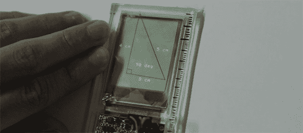

# 几何课刚刚增加了

> 原文：<https://hackaday.com/2013/07/26/geometry-class-just-got-augmented/>

几乎每个工程师都需要上绘画课，但令人惊讶的是，直到现在我们还没有看到电子产品被扔进尺子、丁字尺和铅笔盒里。[Anirudh] [决定把那个](http://vimeo.com/71064267)换成玻璃化的。这是一个嵌入尺子的透明显示器，能够捕捉手绘线条。这些物理线条可以进行交互或测量，从而将尺子变成纸张绘图和数字环境之间的桥梁。

对于显示器，[Anirudh]安装了一个透明的 TOLED 显示器，一个数字化仪输入到一个标尺中。数字化仪捕捉标尺下方的笔画，并能够与物理线条进行交互，以计算线条的长度和角度，或者只是在手绘多边形内反弹数字球。

目前还不知道这款显示器是如何驱动的，也不知道上面运行的是哪种代码。[Anirudh]说他将很快在他的网站上发布一些原理图和代码(现在是 404)。