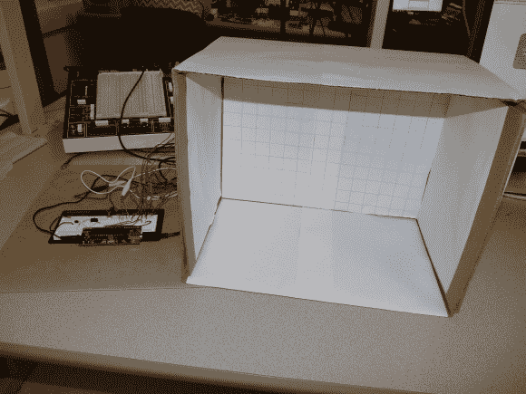

# 基于手势的安全锁

> 原文：<https://hackaday.com/2014/01/02/gesture-based-security-lock/>

康奈尔大学的一个学生团队正在寻找替代方法来创建一个安全系统，该系统可以在封闭的空间中通过使用物理手势来上锁或解锁。

这是[Ankur]、[Darshan]和[Saisrinivasan]电气和计算机工程专业的最后一年项目。系统原型能够记录手势，然后将该手势与将来的手势进行比较，以锁定或解锁系统。把它当成进入办公室的秘密握手吧！

为了分析手势，他们使用四个线性阵列的 SparkFun 接近传感器来感应手移动的距离。ATMega1284P 用于将模拟传感器信号转换为数字信号，以便进一步处理。该项目是非常好的记录，因为它似乎是该项目的最终报告。

休息后的一小段视频展示了原型，并很好地解释了该系统的工作原理。

[https://www.youtube.com/embed/se1PY6f-mAs?version=3&rel=1&showsearch=0&showinfo=1&iv_load_policy=1&fs=1&hl=en-US&autohide=2&wmode=transparent](https://www.youtube.com/embed/se1PY6f-mAs?version=3&rel=1&showsearch=0&showinfo=1&iv_load_policy=1&fs=1&hl=en-US&autohide=2&wmode=transparent)