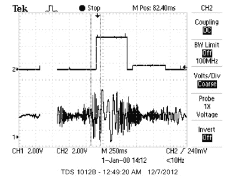

# 使用超声波的手势识别

> 原文：<https://hackaday.com/2014/04/05/gesture-recognition-using-ultrasound/>

如今，你很难找到一个没有免提技术的公共厕所。从厕所到水槽和纸巾自动售货机，免提技术在现代公共厕所无处不在。

这个想法是为了减少细菌的传播。然而，众所周知，这项技术并不完美。我们都从一个水槽到另一个水槽去寻找一个真正有用的。我们中的大多数人都曾在空中疯狂地挥舞双手，以获得纸巾分配器来分配纸巾，并在此过程中创造出新的功夫动作。IR 只是有其局限性。

如果有更好的方法呢？看看[Ackerley]和[Lydia]在使用超声波进行手势识别方面的工作。这种技术很便宜，可以很容易地在无数需要免提控制世界的应用中实现。事实上，自由市场已经在[开发](http://www.ellipticlabs.com/)这种[技术](http://www.chirpmicro.com/)用于智能手机和平板电脑。

摄像机记录视频需要 1 瓦以上的功率，而超声设备只需微瓦。红外仍然可以用来检测手势，就像这个基于[手势的安全锁](http://hackaday.com/2014/01/02/gesture-based-security-lock/#more-111411)一样，但缺乏超声波可以获得的分辨率。因此，让我们深入研究[Ackerley]和[Lydia]的超声波版本的手势识别器的细节，以便我们可以理解它是如何工作的，并且您也可以实现自己的超声波手势识别系统。

我们大多数人都知道多普勒效应——当声源向某一点移动或远离某一点时，波形被压缩和拉伸。考虑一种设备，它由一个高于 20kHz 人耳阈值(超声波)的音调发生器和一个对超声波波形反射做出反应的麦克风传感器组成。如果一个物体，例如一只手，正在向设备移动，反射的波形将经历多普勒频移。这种移动会被麦克风看到。如果物体远离设备，也会发生同样的情况。该频率偏移可以通过下式计算:

为了确定物体是朝向还是远离设备，您必须比较传出频率和传入频率。[Ackerley]和[Lydia]决定使用快速傅立叶变换方程来实现这一点——这与激发他们项目的微软声波所使用的技术相同。不幸的是，分配给他们的处理器 Atmel 1284p 无法同时处理快速傅立叶变换和信号采集。只是还不够快。难倒了，他们的导师提出了一个聪明的主意。这个想法将通过超声波向 8 位微控制器的世界开放手势识别。你看，不是在资源有限的数字端进行频率比较，而是在模拟端用 [AD633 模拟乘法器 IC](http://www.analog.com/static/imported-files/data_sheets/AD633.pdf) 进行频率比较(pdf 警告)。

结果发现，如果将两个正弦波相乘，会得到两个不同的乘积。一个是差值，另一个是两个波形的和。这里面有美。我们的范式已经改变。这个 8 引脚 IC 可以确定输入和输出信号之间的频率差。考虑 24kHz 的输出频率。现在，假设一只手移向器件，产生 24.1kHz 的多普勒频移。AD633 的输出为 1kHz 和 48.1 khz。48.1 khz 很容易滤除，剩下 100Hz，即 8 位微控制器可以轻松采样的输入/输出频率之差。

现在，一双敏锐的眼睛会发现多普勒频移只揭示了大小，而不是方向。[Ackerley]和[Lydia]通过观察差频振幅的细微变化解决了这个问题。关于如何做到这一点的更多细节可以在链接文章中找到。下图显示了他们在 Atmel 中检测“拉动”运动的算法。

这个项目的天才之处在于，一个可行的手势识别系统可以用廉价的组件来实现。用 PC 或智能设备做类似系统的方法会有所不同。我们希望看到微控制器方面的进一步发展。想象一下电梯里的一个系统，乘客可以把号码“画”到他或她想去的楼层。或者一个纸巾系统，当我们转动我们的手时，它会分发纸巾，当我们停止转动时，它也会停止。或者一个简单的手势就能改变水温的水槽。这样的系统，使用[Ackerley]和[Lydia]设计的技术，应该是可能的。