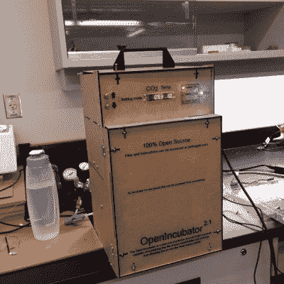

# 用 DIY 二氧化碳培养箱进行生物黑客攻击

> 原文：<https://hackaday.com/2015/07/25/get-biohacking-with-a-diy-co2-incubator/>

[佩林实验室]已经对他们的 DIY 二氧化碳培养箱进行了一段时间的迭代，现在看起来有一个[的新版本正在工作中](https://twitter.com/pellinglab/status/613434323010736128)。

在包括[孵化器](http://hackaday.com/2013/12/30/diy-incubator-cooks-bacteria-or-yogurt/)之前，我们已经介绍了开源 [Biolab 设备](http://hackaday.com/2012/09/09/genetic-research-on-the-cheap/)，但没有介绍 CO2 孵化器。恒温箱可以让你控制室内的温度和气氛。由[Pelling 实验室]建造的培养箱控制着培养室的温度和二氧化碳水平，使它们能够在最佳条件下培养细胞。

虽然商业孵化器可能会花费数千美元，但[Pelling 实验室]使用了聚苯乙烯泡沫盒、太空毯和 SodaStream 水箱以及其他低成本部件。最贵的部件是二氧化碳传感器，价值 230 美元。该装备使用 Arduino 进行反馈和控制。BOM 总成本为 350 美元，他们的解决方案具有成本效益，并为进一步开发提供了一个开放平台。

最初的文章充满了有用的信息，但最近的推文表明一个新的和改进的版本正在路上，我们期待听到更多关于这个令人兴奋的 DIYBio 项目的信息！