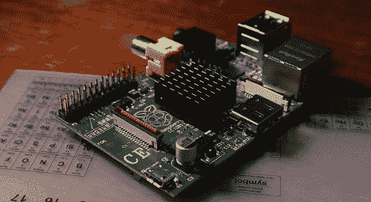

# 绕过 Raspi 的 USB 主机电流限制

> 原文：<https://hackaday.com/2012/09/10/getting-around-the-raspis-usb-host-current-limit/>

作为这样一个革命性的设备，树莓派仍然存在一些问题。首先，USB 主机端口每个端口只能提供 140 mA 的电流，而台式机、笔记本电脑甚至平板电脑上的 USB 端口每个端口可以提供 500 mA 的电流。

官方对这个问题的“修复”是为任何需要超过 140 毫安的设备使用一个带电源的 USB 端口，这不是[Manis]所能接受的。然而，他想出了一个简单的解决办法，只需要几根电线和一个烙铁。

Raspi 上的 USB 端口被一对保险丝限制在 140 mA。[Manis]桥接这些保险丝，用一小段电线有效地将它们从电路中取出。这使得他可以在 Raspi 上使用 USB 硬盘(当然是 USB 驱动的)。

通过 Raspi 的 USB 端口发送这么大的电流有一个小问题。有时，当高功率 USB 设备通电时，电压会下降，重置 SoC 并重新启动系统。[Manis]做了功课，发现 USB 2.0 规格端口[应该使用 120 μF 低 ESR 电容](http://www.usb.org/developers/whitepapers/power_delivery_motherboards.pdf)来防止这种情况。Raspi 备有用于此目的的 47 μF 电容。如果您打算在 Raspi 上使用高功率设备，更换这个盖子(C32)可能是个好主意。