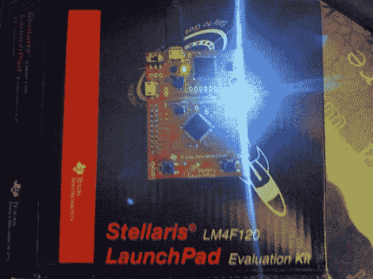

# Stellaris 快速入门

> 原文：<https://hackaday.com/2012/10/11/getting-started-with-the-stellaris-launchpad/>

[](http://hackaday.com/2012/10/11/getting-started-with-the-stellaris-launchpad/img_20121009_222713/)

我们已经给出了 Stellaris Launchpad 的概述，但是让我们看看在设备上运行代码的第一步。首先，我们将让开发软件工作，然后我们将构建并运行一个非常简单的示例。

TI 允许使用他们的 IDE 的完整版本 Code Composer Studio，以及 Launchpad 的板载调试器。要使用 Stellaris 微控制器，您还需要获取 stellar is 软件。这个免费软件包包含对 Stellaris 设备的支持，包括外设驱动程序、USB 库和代码示例。最后，您将需要 ICDI 驱动程序来与调试器通信。TI 拥有该主板所需的所有软件[此处](http://www.ti.com/tool/sw-ek-lm4f120xl "Launchpad Tools")。参见 TI [入门指南](http://processors.wiki.ti.com/index.php/Stellaris_LM4F120_LaunchPad_Blink_the_RGB "Getting Started")了解如何安装所需软件。

## Windows 8

如果您使用的是 Windows 8，驱动程序不会安装，因为它们没有签名。解决方法是通过按住 Shift 键并按下 F8 键来重启并中断 Windows 8 的启动。选择“禁用驱动程序签名强制”选项，让 Windows 启动。您现在可以按照 TI 的说明安装驱动程序。

## 创建项目

安装了这些包之后，我们就可以开始为设备编写代码了。创建一个新的 CCS 项目(File -> New -> CCS Project)并给它命名。选择“ARM”作为族，“Stellaris LM4F120H5QR”作为变型，选择“Stellaris 在线调试接口”作为连接。在“空项目”下选择“空项目(包含 main.c)”，然后单击“完成”。

现在我们需要包含一个头文件，它给出了微控制器端口的名称。为此，单击项目->属性，然后转到构建-> Arm 编译器->包含选项。单击“将目录添加到#include 搜索路径”旁边的加号，单击“文件系统”，并在安装 StellarisWare 的位置下找到“inc”子目录。单击“确定”添加文件夹。

## 制造光

让我们测试一下一切是否正常。在这个简单的例子中，我们将打开 RGB LED 的所有三种颜色。为此，我们打开 LED 所连接的引脚，这些引脚恰好是:

端口 1 = RGB LED 红色
端口 2 = RGB LED 蓝色
端口 3 = RGB LED 绿色

完整原理图见[用户手册](http://www.ti.com/lit/ug/spmu289/spmu289.pdf "User Manual")。代码如下:

```
// processor definitions
#include "lm4f120h5qr.h"
#define LED_RED 0x2
#define LED_BLUE 0x4
#define LED_GREEN 0x8

void main(void) {
  // enable PORT F GPIO peripheral
  SYSCTL_RCGC2_R = SYSCTL_RCGC2_GPIOF;
  // set LED PORT F pins as outputs
  GPIO_PORTF_DIR_R = LED_RED|LED_BLUE|LED_GREEN;
  // enable digital for LED PORT F pins
  GPIO_PORTF_DEN_R = LED_RED|LED_BLUE|LED_GREEN;
  // clear all PORT F pins
  GPIO_PORTF_DATA_R = 0;
  // set LED PORT F pins high
  GPIO_PORTF_DATA_R |= LED_RED|LED_BLUE|LED_GREEN;
  // loop forever
  for(;;);
}
```

用这段代码替换 main.c 中的代码。通过单击运行->调试来调试项目。这将构建您的代码，并将其加载到设备上。要开始执行，请单击运行->恢复。LED 应该亮起白光。改变设置为高电平的引脚将改变 LED 的颜色。

启动和运行 Stellaris Launchpad 有任何问题吗？请在评论中告诉我们。