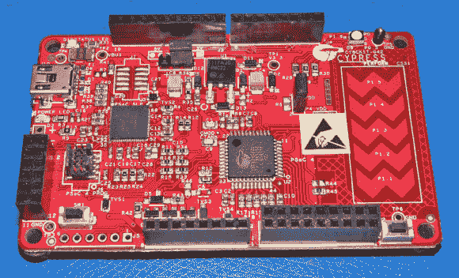
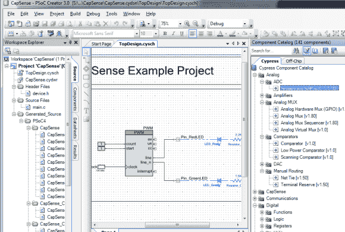
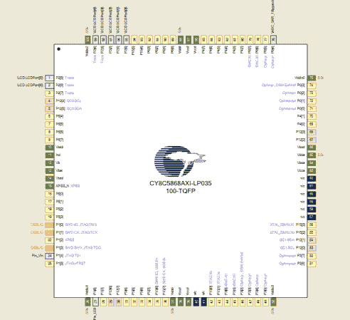

# 视频:使用可编程片上系统体验生活

> 原文：<https://hackaday.com/2014/04/23/getting-your-feet-wet-with-programmable-system-on-chip/>

自从我从 Cypress 收到我的 [PSOC 4 先锋套件，我就想玩这个小小的混合信号可编程片上系统(PSOC)开发板。我喜欢开发板，只要它们的定价能吸引我不仅打开钱包，还能在繁忙的日程中腾出时间。我想我的工具包是免费的，因为我从](http://www.cypress.com/psoc4/ "Cypress Programmable System On Chip") [Adafruit](http://www.adafruit.com/ "Adafruit") 那里赢得了一个大礼包，这是他们自己在开放硬件峰会上获得的，并在他们的每周 [streamcast](http://www.adafruit.com/ask/ "Ask an Engineer") 上分发。最终，是 datasheet.net 测试版的邀请让我加入了 Hackaday，这也包含在那堆赠品中。

[https://www.youtube.com/embed/3h-TkP-iInM?version=3&rel=1&showsearch=0&showinfo=1&iv_load_policy=1&fs=1&hl=en-US&autohide=2&wmode=transparent](https://www.youtube.com/embed/3h-TkP-iInM?version=3&rel=1&showsearch=0&showinfo=1&iv_load_policy=1&fs=1&hl=en-US&autohide=2&wmode=transparent)

## 什么是可编程片上系统？

那么什么是 PSOC 4 号呢？一个简单的总结是，它基于一个 [ARM Cortex](http://en.wikipedia.org/wiki/ARM_architecture "ARM") 精简指令集处理器( [RISC)](http://en.wikipedia.org/wiki/Reduced_instruction_set_computing "RISC") ，并在某种程度上能够支持基于 Arduino 足迹的屏蔽，它还使用了一个亮红色的 PCB，我已经开始将它与一个 [Sparkfun](https://www.sparkfun.com/ "Sparkfun") PCB 联系起来。没有显示的是，除了可编程数字逻辑模块之外，这种可编程片上系统还具有可编程模拟功能模块。PCB 上还有一些支持输入/输出电路，如多色 LED 和电容式触摸传感器。

PSCO4 Development Board on Hackaday

这是一个耐人寻味的可编程性，以至于 Newark/Element 14 在上面突出了一个“ [100 天 100 个项目](http://www.element14.com/community/thread/23736/l/100-projects-in-100-days "100 Projects in 100 Days")”的事件。

## 进入 IDE

多年来，我不得不创建或安装许多集成开发环境( [IDE)](http://en.wikipedia.org/wiki/Integrated_development_environment "IDE") 来连接硬件和软件。知道你必须以及如何实现 IDE 是作为一名工程师的一部分。现在有了 [Arduino](http://www.arduino.cc/ "Arduino") 类型的环境，用户一点击可执行文件就有了一个 IDE，我发现这是这种风格最好的方面之一。事实上，这是如此之快，以至于我能够让我十几岁的儿子编写他的第一个程序，甚至在他记得做大量的翻白眼和发出完全鄙视的声音之前。然而，他放弃了，只是害怕学习如何让 Arduino 代表他发出蔑视的声音。

Closeup of a Programmable System on Chip Development System

## 喜欢你的开发板

PSOC Creator 3.0 Integrated Development Environment

这就是我喜欢廉价开发板的原因，你有理论上已经可以工作的标准硬件，演示项目也很容易提供给 IDE。将未经测试的软件代码加载到一个可能有硬件问题的项目中可能会有一点挑战。从已知工作正常的硬件或软件开始是一个很大的优势，因为您不必对跳出存储器映射边界或地址线熔断或两者之间的差异进行故障诊断。

设置 IDE 包括从 Cypress 网站下载并安装 [PSoC Creator 3.0](http://www.cypress.com/psoccreator/ "PSOC Creator") 并点击执行；我通常会点击“以管理员身份运行”,因为我可以这样做，这让我感觉很棒，就好像我有一个角色要扮演一样。

如上所述，纽瓦克主办了 100 项目活动，我决定尝试 circuit #2，作为练习从选择和编译到下载和使用的所有步骤的一种方式。简单地说，这个例子基于用户触摸电容传感器的位置来改变多色 LED 的颜色。

## 构建并运行

编译和运行该示例是通过一连串快速的鼠标点击来完成的，唯一的停顿是在“清理和构建”步骤。快速点击“调试”和“程序”完成该过程，快速测试显示 LED 的颜色根据 capsense(电容感应)滑块被触摸的位置而变化。在这一点上，模拟和数字元件都包括在内，并根据一张原理图进行配置。

Post-build Pinout of PSCO4 on Hackaday

那么为什么要这样做呢？当用户只需利用一个附加的无焊料试验板时，将模拟与数字一起编译有何意义？答案是，你完全可以使用外部模拟元件实现相同的设计，尤其是因为不是所有的电路都可以用 PSOC 架构实现。然而，如果你喜欢盒子里有不止一把螺丝刀，你会喜欢这个版本的一个问题有多个答案。你可能喜欢这样一个事实，即你可以通过从光盘中取出设计来重新实现它，而不必重新构建无焊料试验板(或者保持电路构建两个月，以防你可能需要它，你在 3.45 个月后这样做)

你可能还会欣赏这种设计的简洁，其中大部分支持电路都隐藏在芯片中，更不用说现实生活中的噪声和可靠性问题了。

或者你可能喜欢它，因为它是一种很酷的模拟编译。

就我而言，我认为这很酷。