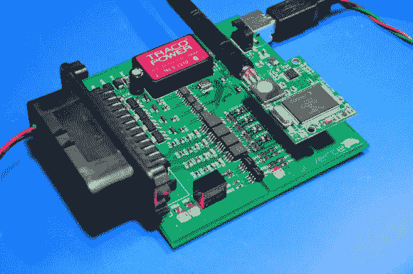

# GeV Cu——开放式通用电动汽车控制单元

> 原文：<https://hackaday.com/2014/03/19/gevcu-an-open-generalized-electric-vehicle-control-unit/>

在 Hackaday，我们非常高兴地看到越来越多的开放硬件设备每天出现在互联网上，我们也对开源电动汽车感到非常兴奋。上图是 [GEVCU](http://www.gevcu.org/) ，一个开源电动[车辆控制单元](http://en.wikipedia.org/wiki/Engine_control_unit)(或 ECU)。它负责处理不同的输入(节气门位置、制动压力、车辆传感器)，然后通过 CAN 总线消息或数字/ PWM 信号向电动机控制器(也称为逆变器)发送适当的控制命令。

该项目始于 2012 年 12 月，最初基于 Arduino Due。从那时起，GEVCU 经历了几次修改，最终产生了一个完整的定制板，同时仍然保留了 M3 皮层 ATSAM3X8E。正如您可能已经猜到的，该板还包括一个 Wifi 收发器，因此用户可以通过基于网络的平台调整 ECU 参数。所有资源都可以从官方 [GitHub](https://github.com/collin80/GEVCU) 下载。