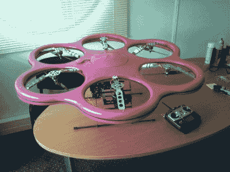

# 巨型粉色六角直升机比其他的稍微安全一点

> 原文：<https://hackaday.com/2012/05/02/giant-pink-hexacopter-is-slightly-safer-than-the-rest/>

看看这架[巨大的粉红色六角直升机](http://www.rcgroups.com/forums/showthread.php?t=1644637)。我们在这里看到成吨的四轴直升机，但是它们的兄弟姐妹六轴直升机并不经常光顾。当他们这样做的时候，他们会像你在上图中看到的那样盛装打扮。这个原型框架是为了保护道具和无辜的旁观者，因为你不可避免地转向你不应该转向的东西。该框架主要由碳纤维制成，为直升机增加了大约 1 千克的重量。虽然它确实能飞，但[AirvewLive]正在寻找什么样的螺旋桨/马达组合能产生更大的耐力。有人有什么建议吗？

我们知道你们中的一些人会很快注意到，他称之为“管道风扇”。我们意识到事实并非如此，我们会原谅他这一次，因为他的身材太酷了。

[谢谢你的提示，迈克]