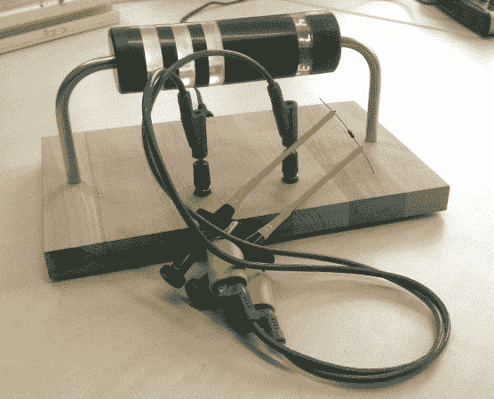

# 巨型电阻形欧姆表

> 原文：<https://hackaday.com/2013/02/12/giant-resistor-shaped-ohmmeter/>

拥有一个巨大的电阻形欧姆表的乐趣在于它可以通过显示颜色代码来读取电阻值。如果你对解码这些波段不太熟悉，右边有一个助手波段，它会显示数值。

所有的电子器件都封装在电阻器的不透明部分，形成了一个漂亮的低剖面底座。弯曲的导线是中空的，允许[Sebastian]和他的朋友将电源和测量导线连接到背面的电源连接器和前面附近的一对香蕉插孔。每个半透明环都装有一个 RGB LED，但右侧的一个除外，其中嵌入了四个 7 段显示模块。ATmega168 使用其模数转换器(ADC)从分压器读取值，从而进行测量。在跳完之后，你可以在视频中看到欧姆表的快速演示。

这将是一件有趣的事情，与那个巨大的试验板配对。

[https://www.youtube.com/embed/dbyu7l34-x4?version=3&rel=1&showsearch=0&showinfo=1&iv_load_policy=1&fs=1&hl=en-US&autohide=2&wmode=transparent](https://www.youtube.com/embed/dbyu7l34-x4?version=3&rel=1&showsearch=0&showinfo=1&iv_load_policy=1&fs=1&hl=en-US&autohide=2&wmode=transparent)