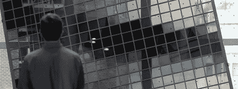

# 巨大的液晶显示器就像一个巨大的计算器

> 原文：<https://hackaday.com/2012/04/27/gigantic-liquid-crystal-display-is-like-a-giant-calculator/>

有人说，他打开烙铁时说，“点火吧！."他死 bug 焊料-QFP 封装。我们只知道他叫[stig],他发来了一个很棒的视频，是北卡罗来纳州罗利自然研究中心的一个新展览。这是一个 10 英尺×90 英尺的液晶显示器，使用 6 英寸见方的玻璃面板，其中含有与计算器中相同的液晶。

该展示/装置被称为自然图案，由 3600 块 LCD 隐私玻璃构成。当给玻璃施加电压时，它会从透明变成不透明。虽然这项技术已经存在了几十年(只要看看你的计算器)，但直到最近几年，LCD 隐私玻璃的价格才下降，使这样的项目变得经济实惠。

这个巨大的展示部分是由 Sosolimited 艺术工作室创作的，该工作室在 T1 之前已经完成了一个类似的项目。挂在罗利自然研究中心中庭的显示器效率惊人，因为它的尺寸只消耗 75 瓦。

如果您想尝试类似的构建，我们祝您好运；这种液晶玻璃仍然有点贵，但也许几年后价格会降得足够低，我们可以在建筑物的一侧玩俄罗斯方块。

[https://player.vimeo.com/video/41009719](https://player.vimeo.com/video/41009719)