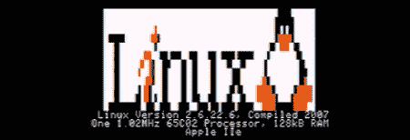

# 用苹果做 Powerpoint 演示][

> 原文：<https://hackaday.com/2012/05/17/giving-a-powerpoint-presentation-with-an-apple/>

当[Vince]看到一位同事用 iPad 做演示时，他心想这是对计算资源的巨大浪费；iPad 就像早期的克雷超级计算机一样强大，显示幻灯片不是一项计算密集型任务。我们假设[文斯]的思路在那一点上偏离了轨道，因为他想出了一个用苹果做演示的简洁方法。

为了把幻灯片放到他的苹果电脑上，[Vince]开发了一个工具，把演示文稿的文本和图像转换成 Applesoft BASIC 程序。是的，280×192 的分辨率支持六色图像。演示文稿被转移到 CompactFlash 卡上，并在 CFFA 卡的帮助下加载到苹果电脑上，这使得在演示过程中加载图像比 5.25 英寸的磁盘快得多。

当然，演示结束后，[文斯]的一些同事想玩“俄勒冈之路”，这个请求很容易被装载了苹果[程序]的大容量 CF 卡处理。休息之后，你可以看看他演讲的视频演示。

[https://www.youtube.com/embed/wB0y-jSNW_c?version=3&rel=1&showsearch=0&showinfo=1&iv_load_policy=1&fs=1&hl=en-US&autohide=2&wmode=transparent](https://www.youtube.com/embed/wB0y-jSNW_c?version=3&rel=1&showsearch=0&showinfo=1&iv_load_policy=1&fs=1&hl=en-US&autohide=2&wmode=transparent)