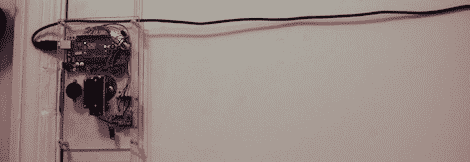

# 给公寓无钥匙进入

> 原文：<https://hackaday.com/2012/11/12/giving-an-apartment-keyless-entry/>

[rybitski]公寓的钥匙是一个副本的副本，房东几年前丢失了原始钥匙。锁本身仍然工作，但是用[rybiski]的钥匙打开它是一件麻烦事。他想让进入他的公寓变得更容易，他想用 Arduinos 和类似的东西为他的前门制作一个无钥匙进入装置。【T2

在弄清楚如何用 Arduino 和一个相当强大的伺服系统打开他的死栓后，[rybiski]开始研究无线控制选项。他发现[是一个无钥匙进入遥控器](http://www.canton-electronics.com/2-pcs-4-way-ev1527-encoder-remotes-1-pcs-super-regenerative-receivers-433mhz-p-224.html)，配有接收器，可以完美地集成到任何微控制器项目中。

在一块塑料上安装了 Arduino、接收器和伺服系统后，他将他的装置连接到插销上。在休息后的视频中，你可以看到他的钥匙链远程锁定和解锁锁舌，所有这些都没有将不合适的钥匙插入锁中。

[https://www.youtube.com/embed/tHlz93s54dw?version=3&rel=1&showsearch=0&showinfo=1&iv_load_policy=1&fs=1&hl=en-US&autohide=2&wmode=transparent](https://www.youtube.com/embed/tHlz93s54dw?version=3&rel=1&showsearch=0&showinfo=1&iv_load_policy=1&fs=1&hl=en-US&autohide=2&wmode=transparent)