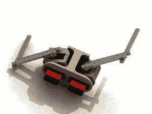
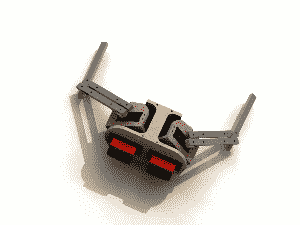

# 赋予一个不死娃娃生命

> 原文：<https://hackaday.com/2014/10/22/giving-life-to-an-undead-baby-doll/>

如果这个月雕刻南瓜对你来说太过时了，那么试试[杰森·苏特]的 instructable，做一个[电子无腿僵尸小孩](http://www.instructables.com/id/Make-a-Crawling-Robot-Zombie-with-Severed-Legs/)，它一定会让那些害怕洋娃娃或其他表情空洞的玩具婴儿的人感到害怕。

为了给机器人升级腾出空间，从一个祭祀玩偶开始，[杰森]从躯干上肢解了所有的肢体和头部。驱动新木制榫骨的伺服电机安装在用数控机床切割的底盘上。[Jason 的]说明包括一些漂亮的图表，展示了肩部和肘部的关节点如何协同工作，以产生不同风格的爬行和拖动。

 

最重要的是，头部用肌腱连接到自己的安装板上，肌腱以一种悲惨的不死方式来回摆动。作为一个额外的细节，他解释了如何在电路中安装蓝牙模块，这样他就可以远程调整并上传他的示例代码到 Arduino 大脑，而不需要把手靠近它。当然，需要一些额外的熔化、绘画和玩偶折磨来实现粗糙的不死外观…但这只是在一个制作精良的电子动画上锦上添花。

在他的视频中[Jason]向我们概述了他的僵尸构建，并展示了它的实际应用:

[https://www.youtube.com/embed/yLBsMKrf0dU?version=3&rel=1&showsearch=0&showinfo=1&iv_load_policy=1&fs=1&hl=en-US&autohide=2&wmode=transparent](https://www.youtube.com/embed/yLBsMKrf0dU?version=3&rel=1&showsearch=0&showinfo=1&iv_load_policy=1&fs=1&hl=en-US&autohide=2&wmode=transparent)