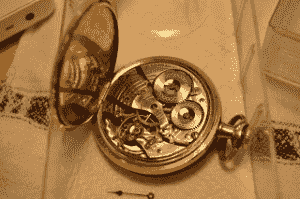
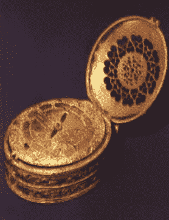
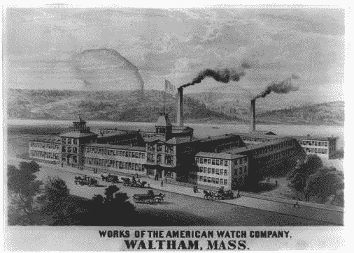
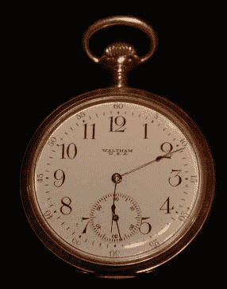
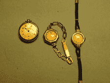
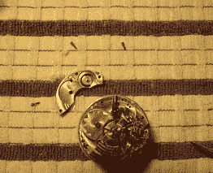
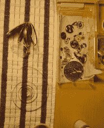
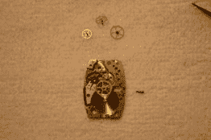
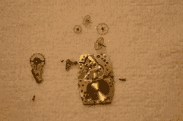
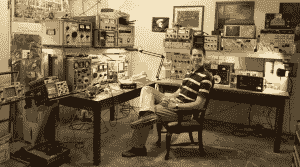

# 去复古！学习修理和修复机械怀表和手表。

> 原文：<https://hackaday.com/2014/07/08/go-vintage-learn-to-repair-and-restore-mechanical-pocket-and-wrist-watches/>

直到最近，手表一直完全是机械的，每个轮子、齿轮和机械装置都代表着我们对精密制造和计时理解的一个里程碑。

One of the very first watches, created by a locksmith.

如今，几乎不可能找到钟表匠来维护或修理老式机械表袋和手表，所以我们必须自己动手。学习修理老式机械表。你可以做到这一点，我们会告诉你怎么做。

他们滴答作响，机械表有脉搏。这些早期的手表最初是在 16 世纪由锁匠创造的，只能精确到小时，因此只能用一根时针显示时间。

到了 18 世纪，fusee 技术使手表的精确度达到了几秒钟之内。

Fusee wheel and chain, which is in effect a continuously variable transmission to provide constant torque as spring barrel unwinds.

沃尔瑟姆钟表公司。是第一个通过开发一种流程来大规模生产极其精确的高品质手表，从而实现便携式计时民主化的公司。价格相当于今天的 MacBook 或 iPad。美国钟表业在开发世界级产品方面处于领先地位，这种产品只需少量维护，就能经久耐用。

  American Waltham Watch Factory  Example of a Waltham Pocket Watch

但是女士手表正在推动可能的界限，在小的尖端。女式手表导致了(比怀表小的)手表的发展。

Evolution of the ladies pocket watch to wrist watch. Manufacturing techniques were pushed to their limits in making small watches.

手表在 20 世纪 30 年代得到了广泛的应用。虽然没有怀表精确，但手表明显更加方便。瑞士人在战后手表技术方面处于领先地位。

#### 一种你必须自己做的爱好

如果你想成为古董，你必须能够清洗和修理你自己的手表。如果你能找到一个愿意花 200-400 美元修理手表的人，钟表匠是一个濒临灭绝的物种。此外，最大的乐趣是能够穿你自己修理的东西。在聚会上打开你的手表，向你的朋友解释它是如何工作的。

没有所谓的“过度缠绕”，实际上发生的是灰尘和污垢堆积在轴承上，使轮子(实际上是齿轮，齿轮指的是轮子)不能自由转动，阻止机芯运转。机芯从发条(发条盒)开始显著加速，发条盒的一圈带动秒针转动数百圈。不幸的是，在这种传动装置下，秒针处的扭矩非常小。由于这个原因，整个齿轮系的轴承中的一点点灰尘和污垢都会导致机芯停止运转。大多数时候，当你买了一只坏了的机械表，它需要的只是清洗和上油。但这并不像看起来那么容易，你必须完全拆掉你的手表机芯，清洁每个小零件，重新组装并上油。

#### 去哪里学

这段视频将向你展示现代腕表如何从发条盒到摆轮运作:

[https://www.youtube.com/embed/508-rmdY4jQ?version=3&rel=1&showsearch=0&showinfo=1&iv_load_policy=1&fs=1&hl=en-US&autohide=2&wmode=transparent](https://www.youtube.com/embed/508-rmdY4jQ?version=3&rel=1&showsearch=0&showinfo=1&iv_load_policy=1&fs=1&hl=en-US&autohide=2&wmode=transparent)

要学修表看手册，[美军 TM9-1575](http://www.90thidpg.us/Reference/Manuals/TM%209-1575.pdf) (PDF)。在第二次世界大战中，许多像这样的手册被用来训练任何 18 岁的人在短时间内学习高级技能。

#### 清洁和涂油

为了让它再次运转，你必须完全拆开它，在超声波清洗器中清洗它的机械部件和板，并按照 TM9-1575 中的程序给它上油。

  Taking apart a Waltham Riverside Pocket Watch  Parts set out to dry after cleaning  Waltham Riverside pocket watch after cleaning and oiling.  Elgin Mens wristwatch drying after cleaning, all parts shown disassembled.  Elgin men’s wrist watch during disassembly.  More disassembly.

#### 逐步操作视频

有关手表维修和清洗各种怀表和腕表的视频，请查看 YouTube 上的手表维修频道。

如何拆卸(准备好非常有趣的评论):

[https://www.youtube.com/embed/Iip__1z_wu0?version=3&rel=1&showsearch=0&showinfo=1&iv_load_policy=1&fs=1&hl=en-US&autohide=2&wmode=transparent](https://www.youtube.com/embed/Iip__1z_wu0?version=3&rel=1&showsearch=0&showinfo=1&iv_load_policy=1&fs=1&hl=en-US&autohide=2&wmode=transparent)

重新组装很费时间，这也是经常发生故障的地方。在这个视频中，[bunnsspecial]在 33 分钟内完成重新组装，速度非常快。下面是清洗后如何重新组装(再次，另一个丰富多彩的评论):

[https://www.youtube.com/embed/-58IdLTcQBk?version=3&rel=1&showsearch=0&showinfo=1&iv_load_policy=1&fs=1&hl=en-US&autohide=2&wmode=transparent](https://www.youtube.com/embed/-58IdLTcQBk?version=3&rel=1&showsearch=0&showinfo=1&iv_load_policy=1&fs=1&hl=en-US&autohide=2&wmode=transparent)

#### 您将需要的工具

得到一套珠宝商的螺丝刀；好的是美国、瑞士或法国制造的，不是中国制造的。老式手表中的螺丝比螺丝刀头更坚硬，便宜的螺丝刀会很快碎裂。

*   机芯支架
*   加油工
*   牙签。
*   机器油
*   超声波清洁器
*   清洁溶液和冲洗
*   珠宝商镊子，非磁性
*   去磁器
*   其他小工具你可能已经有了。

#### 开始你的收藏

你可以在古董店或易趣上买到古董表，它们不太贵。预计支付 50-100 美元的一个耐用的美国男子怀表(沃尔瑟姆，埃尔金)和稍微多一点的高端美国怀表(汉密尔顿，汉普顿，伊利诺伊州)。根据款式和状况，一只老式手表的价格为 100 美元，10-100。你必须寻找的关键问题是一个好的平衡人员。测试的一个方法是拿一根牙签，触摸摆轮，观察它是否自由移动，如果是，那么你应该能够维修手表。此外，如果手表运行有些停止，它可能有一个良好的平衡工作人员。

#### 加入社区

需要帮助或想了解更多，参加课程，参加聚会？加入 NAWCC，在他们的论坛上寻找你的问题的答案。

#### 爷爷的传家宝手表

不要修复对你有重大意义的手表。预计会损坏或永久损坏你的第一批一两只怀表和大约一半的第一批手表。即使你在这方面做得越来越好，我也不建议你清洗高端秒表。如果你不能忍受自己弄坏或损坏它，那么不要自己修复，让专业人士来做。不幸的是，如今手表修理店少之又少，大多数都无法处理复杂的老式机械机芯。我工作过的最好的一家公司就在底特律北部，名为 [J & W 钟表修理公司](https://plus.google.com/107305073991087186954/about?hl=en)。这些家伙是如此老派，他们甚至没有一个网站，所以你必须打电话给他们，并邮寄。

#### 你能做到的

修表是一项令人着迷的爱好，是为数不多的值得你亲自动手的事情之一。没有什么比拆开一个停止运转的机芯，进行修理和清洁，然后看着它再次运转更令人满意的了。表达自己，穿复古的衣服，与历史建立联系，在下一次社交聚会上总是有一个故事解释这些小机器是如何工作的。

* * *

 从 2007 年 9 月到 2011 年 11 月，他是麻省理工学院林肯实验室的技术人员，他在穿墙雷达方面的工作在 2010 年 MSS 三军雷达研讨会上获得了[最佳论文](https://www.ll.mit.edu/news/2011bestpapers.html)，并且是[麻省理工学院教务长办公室 2011 年研究亮点](http://web.mit.edu/ir/highlights/research.html)。他在麻省理工学院教授短期雷达课程，他的[构建小型雷达课程](http://ocw.mit.edu/resources/res-ll-003-build-a-small-radar-system-capable-of-sensing-range-doppler-and-synthetic-aperture-radar-imaging-january-iap-2011/)是 2011 年麻省理工学院专业教育课程中排名第一的课程，并被其他大学、实验室和私人组织广泛采用。[从早年](http://glcharvat.com/Dr._Gregory_L._Charvat_Projects/Starting_at_an_Early_Age.html)开始，格雷格研发了无数[雷达系统](http://glcharvat.com/Dr._Gregory_L._Charvat_Projects/Radar.html)、[轨道 SAR 成像传感器](http://glcharvat.com/Dr._Gregory_L._Charvat_Projects/Synthetic_Aperture_Radar_(SAR).html)、[相控阵雷达系统](http://glcharvat.com/Dr._Gregory_L._Charvat_Projects/Phased_Array_Radar.html)；拥有多项专利；并开发了许多其他传感器和[收音机](http://glcharvat.com/Dr._Gregory_L._Charvat_Projects/Amateur_Radio.html)和[音响设备](http://glcharvat.com/Dr._Gregory_L._Charvat_Projects/Vacuum_Tube_Audio.html)。他创作了许多出版物，并因其作品受到了媒体的广泛关注。Greg 于 2007 年获得密歇根州立大学电气工程博士学位，2003 年获得 MSEE 博士学位，2002 年获得 BSEE 博士学位，他是 IEEE 的高级成员，曾在 2010 年、2013 年和 2016 年 IEEE 国际相控阵系统和技术研讨会指导委员会任职，并于 2010 年至 2011 年担任 IEEE 天线和传播学会波士顿分会主席。