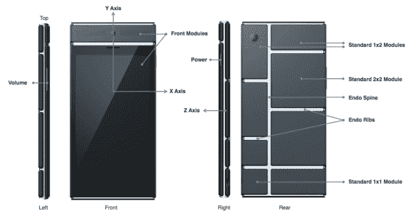

# 谷歌发布 Ara MDK 项目

> 原文：<https://hackaday.com/2014/04/11/google-releases-project-ara-mdk/>

我们听说模块化智能手机已经有一段时间了，但谷歌刚刚为 Project Ara 发布了[模块开发工具包](http://www.projectara.com/mdk/) (MDK)。开发工具包概述了项目的内部工作方式，并提供了用于构建您自己的模块的模板。

一旦您同意许可协议并下载了 MDK，您会发现一个大的规范文档。它解释了手机如何由许多模块组成，这些模块被装入一个内骨骼中，提供机械支撑和电气连接。接口块通过 LVDS 为每个模块提供电源和数据。模块由一个可通过软件切换的[永久磁铁](http://en.wikipedia.org/wiki/Electropermanent_magnet)固定。

当您完成规范文档后，您可以开始参考设计。这些包括 WiFi、热成像、电池组等的模板和实际模块。机械 CAD 以 STEP 文件和图纸的形式提供，电气设计文件以 Altium 项目和 PDF 原理图的形式提供。

过去我们在 Hackaday [上讨论过 Project Ara 和 Phonebloks，但现在我们开始看到真正的细节。谷歌的](https://hackaday.com/2013/10/30/ask-hackaday-does-project-ara-solve-the-phonebloks-problems/) [Project Ara 开发者大会](http://www.projectara.com/ara-developers-conference/)将于 4 月 15 日和 16 日举行，你可以注册免费远程参加。这是开放式、模块化手机的开始吗？让我们知道你的想法。

[感谢亚当的提示]