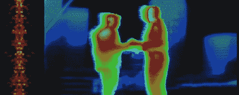

# 谷歌的 Project Glass 和其他头戴式显示器

> 原文：<https://hackaday.com/2012/04/07/googles-project-glass-and-other-head-mounted-displays/>

如果你过去一周一直生活在岩石下，谷歌[宣布了 Project Glass](https://plus.google.com/111626127367496192147/posts) ，这是一款真正实用的头戴式电脑。谷歌眼镜是谷歌内部超级酷的研发部门 Google X 正在开发的项目之一。船上有[巴巴克·帕尔维兹]、[李家鼎]和[巴斯蒂安·特龙](也就是去年你[从](http://hackaday.com/2011/09/05/want-to-learn-artificial-intelligence-good/)那里学到人工智能的那个家伙)。

除了谷歌眼镜团队上传的一个很棒的视频外，没什么可说的。除了概念图之外，没有任何硬件描述，也没有任何关于软件、语音输入，甚至没有完整的功能列表。在这些信息最终确定之前，所有的制造商、黑客和建筑商都有责任弄清楚如何在公共场合使用头戴式显示器，而不会引起异样的目光。以下是我们多年来看到的几款可穿戴电脑和头戴式显示器:

#### DIY 单眼显示器

第一张[来自 2009 年](http://hackaday.com/2009/02/02/monocular-head-mounted-display/)，当时 Hack a Day 上的所有图像都是黑白的，边缘有一些胶带。【Xenonjon】有一台旧的[奥林巴斯 Eye-Trek](http://www.olympusamerica.com/cpg_section/cpg_eyetrek.asp) ，用它的一半做了一个单眼显示器。眼游在 VGA 分辨率下达到极限；对于离你眼睛一英寸的东西来说足够了，但是祝你好运找到一个用过的。

我们希望谷歌眼镜项目能够允许一点点超感官知觉，就像捕食者的热视觉或[Geordi LaForge]的护目镜能够看到从 1 赫兹到 100，000 THz 的电磁频谱(*杰作协会*，[第五季第十三集](http://www.st-minutiae.com/academy/literature329/213.txt)，甚至可能是 TNG 理工学院都不可能做到的)。在黑暗中看东西[已经用一台摄像机 CRT、一台低光安全摄像机和一束红外发光二极管完成了](http://hackaday.com/2010/10/02/diy-night-vision-monocle/)。

#### 极其便携的计算

谷歌眼镜背后的部分挑战是让电脑几乎看不见。手机很小，但即使是最小的手机也太笨重，不能整天戴在脸上。大型硬件制造商比我们普通人有优势，但这并没有阻止[布拉德]为现实生活中的抓旗游戏制作[HUD。](http://hackaday.com/2010/02/11/hud-for-real-life-capture-the-flag/)

既然你会一直带着电脑，那你就有理由一直捕捉大量的生物特征数据。心率、葡萄糖和激素水平、血液酒精含量，甚至脑电图读数。[已经完成](http://hackaday.com/2009/03/28/the-narcisystem/)并且产生了[大量的数据。](http://www.gradman.com/narscisystem)我们迫不及待地想在这个月的前 10 分钟达到我们的手机数据上限。

这是谷歌和其他公司可能推出的商品化硬件在 10 年内可能实现的一个简短列表。我们确信我们会看到这些便携式电脑的一些有趣的用途，希望我们能在附近向你展示它们。

查看项目玻璃视频和所有其他标题图片，我们可以在下面的这个帖子中使用。

[https://www.youtube.com/embed/9c6W4CCU9M4?version=3&rel=1&showsearch=0&showinfo=1&iv_load_policy=1&fs=1&hl=en-US&autohide=2&wmode=transparent](https://www.youtube.com/embed/9c6W4CCU9M4?version=3&rel=1&showsearch=0&showinfo=1&iv_load_policy=1&fs=1&hl=en-US&autohide=2&wmode=transparent)

此幻灯片需要 JavaScript。