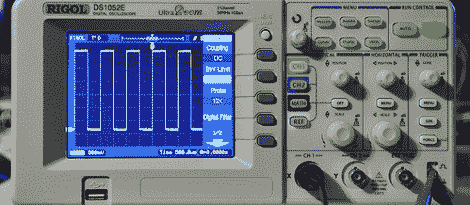

# 用 Python 从 Rigol 范围获取数据

> 原文：<https://hackaday.com/2012/03/30/grabbing-data-from-a-rigol-scope-with-python/>

虽然一个花哨的 Rigol 1052E 示波器是一个很好的工具，也是我们极力推荐的一个很棒的便携式示波器，但有时你只需要使用示波器更“高级”的功能。幸运的是，[cibomahto]想出了如何使用 Python 来[使用 Rigol 示波器，允许在任何台式计算机上轻松远程查看和控制 Rigol 1052 e’示波器。](http://www.cibomahto.com/2010/04/controlling-a-rigol-oscilloscope-using-linux-and-python/)

[cibomahto]的 Python 脚本抓取屏幕，并可以向示波器发送命令，有效地避免了对稍微可怕的 Rigol Ultrascope 软件的需要。不仅如此，在 OS X 和 Linux 下控制 1052E 也是可能的，因为[cibomahto]的工作具有可移植的 Python 特性。

Rigol DS1052E 已经成为事实上的标准示波器，为全球制造商和黑客的工作台增光添彩。凭借低廉的价格、[将带宽翻倍的能力](http://hackaday.com/2010/03/31/update-50mhz-to-100mhz-scope-conversion/)，以及活跃的[自制软件开发场景](http://hackaday.com/2011/12/31/homebrew-on-the-rigol-ds1052e-scope/)，我们怀疑【cibomahto】通过 USB 抓取数据的工作将是我们看到的这款优秀机器的最后一次入侵。

感谢[Markus]发送此邮件。