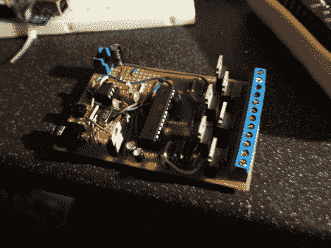

# 图形均衡器显示屏随着节拍闪烁 LED 符号

> 原文：<https://hackaday.com/2012/05/14/graphic-equalizer-display-flashes-led-sign-to-the-beat/>

仔细的计划和稳定的手让[Leo Rampen]满足了他在 LED 墙壁标志上建立一个图形均衡器显示的需要。有许多元件需要安装在这块板上，他决定不使用蚀刻板来构建。

该项目的想法开始只是一个 LED 标志。在用 LED 灯拼出“汗箱”后，他需要一种开关灯的方法。但是为什么就此打住呢？他还决定在构建中使用 MSGEQ7 芯片，因为该标志装饰了他们的聚会室，并且添加基于音乐的闪光灯似乎是一个好主意。

他设计了均衡器芯片 ATmega328(运行 Arduino 引导程序)和一系列 N 沟道 MOSFETS，用于在 Eagle 中切换 LEDS。手里拿着设计，他抓起一块中等大小的条板，用钻头在必要的地方切割出痕迹。最后，他有一个非常华丽的标志，如休息后的剪辑所示。

[https://www.youtube.com/embed/fadagQ7y7Q4?version=3&rel=1&showsearch=0&showinfo=1&iv_load_policy=1&fs=1&hl=en-US&autohide=2&wmode=transparent](https://www.youtube.com/embed/fadagQ7y7Q4?version=3&rel=1&showsearch=0&showinfo=1&iv_load_policy=1&fs=1&hl=en-US&autohide=2&wmode=transparent)