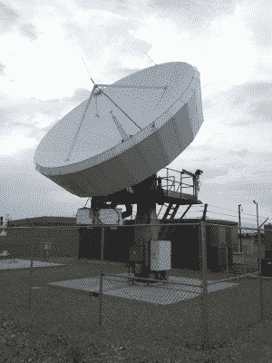
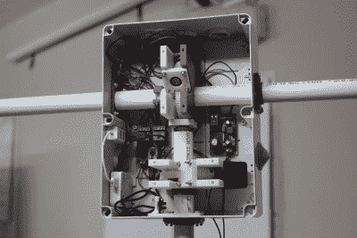
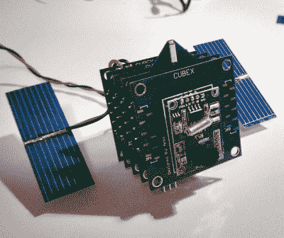

# 地面站只是开始:卫星的故事

> 原文：<https://hackaday.com/2015/02/19/ground-stations-are-just-the-beginning-the-satnogs-story/>

当你想到卫星时，你可能会想到航天飞机伸出它的机械臂，上面有一个巨大的高科技设备等待着进入轨道。这种误解类似于在考虑计算机时想象巨大的大型机。卫星的未来(甚至可以说是现在)更小、更便宜、更高产。如果自由空间基金会对此有什么要说的话，这个未来也是一个“开放”的未来。

这个计划让任何人都可以使用卫星通信的组织最初是在黑客空间建立的。一个好主意，一套共享的技能和经验，一点点时间，让他们完成了惊人的事情。当然，我们谈论的是 2014 年黑客日大奖的大奖得主[。SatNOGS 团队建立了一个工作卫星地面站，并为连接到该站的数据共享网络奠定了基础。但是，即使是这样的描述也可能有点令人生畏，所以请跟我来了解这是怎么回事，以及它对您有什么影响。](http://hackaday.io/project/1340-satnogs-global-network-of-ground-stations)

## 众包卫星地面站

“BoiseSatelliteDish” by Kencf0618 – CC BY-SA 3.0 [via Wikimedia Commons](http://commons.wikimedia.org/wiki/File:BoiseSatelliteDish.jpg#mediaviewer/File:BoiseSatelliteDish.jpg)

自从卫星出现以来，卫星地面站就一直存在。它只是与太空中的卫星通信的天线。传统的模型是一个巨大的盘子，有时被封闭在一个白色的圆顶里。

有几件事需要考虑。首先，单个地面站只能在卫星处于地球静止轨道的情况下与卫星保持联系(意味着卫星总是在地球上同一点的上方)。指向这些卫星的碟形天线与这些卫星保持着近乎持续的通信。想在这上面花点时间吗？不可能！

第二，没有锁定在同步轨道上的卫星只在每次通过的一小部分时间里与一个地面站联系。最终这个星球挡住了你的去路，你需要一个在地球另一个地方的地面站，在你处于黑暗状态时与它联系。

Internals of a SatNOGS ground station.

SatNOGS 项目旨在解决上述两个问题。它从硬件开始；一个开放的设计，可以使用现成的工具和合理的技能组合以最低的成本构建。自举你自己的接收器是保证你访问地面站的一种方法。但是如果你也愿意和别人分享一些时间，你就解开了第二个问题的答案。

SatNOGS 项目允许多个地面站同步它们的数据，并在全世界的每个硬件实例上安排时间。对于任何给定的卫星，地面站必须在正确的时间指向正确的地点。平台设计通过将调度数据发送回每个地面站来解决这一问题，地面站将自动调整其目标，以与下一次卫星捕获请求保持一致。

建立网络是关键。随着越来越多的人建立和部署自己的硬件，每个人在收集卫星数据时都会获得更大的份额。

## 这比 SatNOGS 更重要:自由空间基金会

从上面的描述中，我们确信你同意这不仅仅是几个朋友之间的项目。这是一场运动。SatNOGS 团队很早就意识到了这一点，并构想了一个组织来帮助照亮道路。自由空间基金会成立的理念是所有的卫星通信都应该有一个开放的模型。这意味着卫星本身、地面站和数据。

我们已经提到了大奖，当然是太空旅行。我们真的希望看到一个黑客报名参加这样的冒险，但我们对另一种选择感到兴奋。**SatNOGS 团队选择了 196，418 美元的现金选项，并将其投资于 LSF 的 Libre 太空基金会。**这是一个很好的开端，但 LSF 需要的不仅仅是资金。他们需要人们采纳并推进他们的愿景。

## 小熊队

【Arko 的】卫星项目[Cubex via hackaday . io](http://hackaday.io/project/270-cubex)

我们之前提到的那些更小更便宜的卫星来自于很多不同的玩家。它们通常被称为[立方体](http://en.wikipedia.org/wiki/CubeSat)，通常每边长 10 厘米。大学已经建立和启动这些项目一段时间了。毫无疑问，这是一个巨大的工程挑战，但这也是在近零重力下进行实验的一种方式。

私营企业也参与了这一行动。行星实验室已经发射了他们称之为“群”的这些小卫星，它们一起工作形成了行星的线扫描仪。该系统每 24 小时拍摄一次整个地球的图像。

已经有概念证明都指向个人卫星。没错，你可以拥有一颗卫星。就像前面两个例子一样；把它造得很小，然后作为额外的货物发射出去。就在几年前，我们看到了一个非常成功的关于这个话题的众筹活动。还有[我们自己的 Hackaday.io 有无数的卫星](http://hackaday.com/2015/02/13/hacklet-34-satellite-projects/)，值得对它们进行一次围捕。

## 卫星数据

你能从这些卫星上获得什么样的数据？很容易假设所有这些都是加密的和专有的，但事实并非如此。当然，媒体和通信卫星不会把《权力的游戏》的最新一集传到你家建造的地面站。但是有很多卫星在公开传播有用的数据。

举一个非常有趣的来源，美国国家海洋和大气管理局(NOAA)有一系列卫星监测天气并将数据传回地球。记录这些传输是[多年来我们已经见过多次](http://hackaday.com/2011/10/20/grab-your-own-images-from-noaa-weather-satellites/)的伎俩。

我们很少看到的一种情况是从研究卫星上获取数据集，比如由大学项目发射的卫星。无需等待研究人员的发表就能获得数据，这意味着有更多的机会进行同行评审，并能更好地用于教育目的。

也有可能形成你自己的通信网络。现在 SatNOGS *硬件*是一个只接收的单元。但是软件栈已经准备好发送和接收。这意味着 DVB-T 加密狗将被替换为带有发射器的东西，并且很可能需要大多数领域的许可(例如，业余无线电许可证)，但这些都不是需要跨越的大障碍。如前所述，LSF 希望为卫星开发开放硬件和开放源代码软件设计。想象一下你自己的数据网络。在太空中。既然*是*一个勇敢的新世界。

## 以下是你可以提供帮助的方式

我们喜欢有远大的梦想，让我们兴奋的是 LSF 正在这样做。但是他们需要你的帮助。

SatNOGS 地面站的第三版正在开发中，他们可以利用所有领域的专家来提供帮助。最值得注意的是，射频设计有助于改善通信，以及机械设计，以确保建设将经得起时间和天气。查看 SatNOGS 社区了解更多关于直接参与的信息。

不具备自己构建这些的技能？不要担心，只是传播这个词是一个很大的帮助。在你当地的黑客空间做一个演讲，或者只是纠缠你所有的邻居。这是太空，每个人都想听到，对不对？