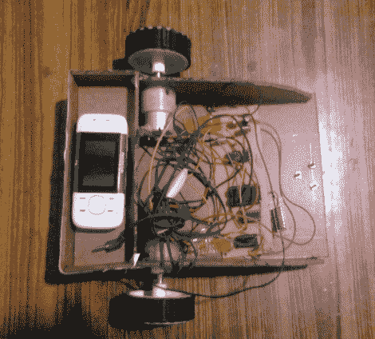

# 不需要微控制器的 GSM 控制汽车

> 原文：<https://hackaday.com/2012/07/12/gsm-controlled-car-without-needing-a-microcontroller/>

不，这里没有微控制器，只有一个成熟的手机作为这个小机器人的大脑。其工作原理背后的秘密在于手机发出的声音。被称为 DTMF 的按键音由安装在机箱前半部分的电路监控，并负责驱动电机。

[Achu Wilson]围绕 MT8870 芯片构建了电路，该芯片解码 DTMF 声音，并使用 BCD 输出来馈送一些逻辑芯片。一个 4 线至 16 线解码器和一个逆变器芯片格式化信号，用作 L293D 电机驱动器的输入。休息后的视频显示，他通过按手机上的数字(像一个拴着的遥控器)直接驾驶火星车。但是他提到可以远程拨打电话和按下号码。我们认为您需要手动接通电话，因为我们无法自动接听电话。

这当然是一种有趣的方式来玩 DTMF 协议。

[https://www.youtube.com/embed/pviOTTA08FY?version=3&rel=1&showsearch=0&showinfo=1&iv_load_policy=1&fs=1&hl=en-US&autohide=2&wmode=transparent](https://www.youtube.com/embed/pviOTTA08FY?version=3&rel=1&showsearch=0&showinfo=1&iv_load_policy=1&fs=1&hl=en-US&autohide=2&wmode=transparent)