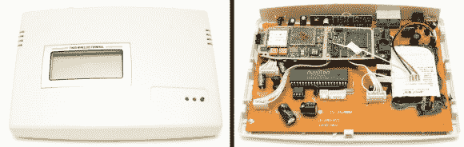

# GSM 转座机盒子内部创造性地焊接了一部手机

> 原文：<https://hackaday.com/2013/01/22/gsm-to-landline-box-has-a-creatively-soldered-cellphone-inside/>

我们不怪这个 GSM 到座机转换盒的制造商没有从头开始设计这个东西。毕竟，大规模生产使得智能手机几乎可以免费获得。但是你不得不承认，看到一个完全组装好的手机板被创造性地焊接到一个消费产品上是很有趣的。如果是在你的地下室制造而不是在商店出售，那将是很平常的事情。

[Anton]正在用这个盒子把他的模拟家庭电话加入手机网络。家里的信号强度很低，这个盒子提供了一个外部天线，接收效果更好。他打开箱子，希望看到一个 GSM 调制解调器，却惊讶地看到了手机板。它包括一个备用电池，并通过一些 SIL 连接器直接焊接到与主 PCB 接口的电缆上。这些焊点是用手工直接焊接到 SIM 卡插槽的针脚以及所有其他重要的连接点上的。