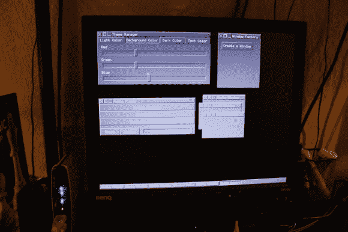

# AVR 芯片上的 GUI 窗口管理器

> 原文：<https://hackaday.com/2013/04/20/gui-window-manager-on-an-avr-chip/>

这个项目让人想起过去的日子，那时窗口管理器是一个惊人的新想法。不同的是，这个基于窗口的 GUI 运行在 ATmega1284 微控制器上。但是，如果在 90 年代早期的家用电脑上工作，界面的行为和速度几乎完全是你所期望的。它甚至使用鼠标作为输入。

这怎么可能呢？该项目的关键是一个串行到 VGA 模块，它处理与生成 VGA 信号有关的繁重工作。我们重点介绍了[Andrew]过去的一个项目，其中[使用 AVR 芯片来产生 VGA 信号](http://hackaday.com/2013/03/29/avr-vga-generator/)。但这并没有留下足够的周期来实现像窗口管理器这样的东西，更不用说它还没有达到这里显示的分辨率。

他使用一个带有 RS-232 转换芯片的串行鼠标与 windows 交互。这在休息后他的视频中得到了最好的展示。他能够生成新窗口并与之交互。他甚至实现了一组基本的控件，允许他调整窗口的主题，并驱动他正在使用的 VGA 控制器上包含的音频播放功能。

[https://www.youtube.com/embed/acY2M-F4FTg?version=3&rel=1&showsearch=0&showinfo=1&iv_load_policy=1&fs=1&hl=en-US&autohide=2&wmode=transparent](https://www.youtube.com/embed/acY2M-F4FTg?version=3&rel=1&showsearch=0&showinfo=1&iv_load_policy=1&fs=1&hl=en-US&autohide=2&wmode=transparent)