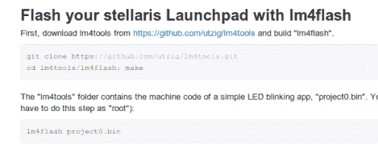

# 在 Linux 系统上使用 Stellaris Launchpad 开发指南

> 原文：<https://hackaday.com/2012/10/29/guide-to-developing-with-the-stellaris-launchpad-on-a-linux-box/>

所以你拿起了你自己的 Stellaris Launchpad，一个 TI ARM 开发板，它可以在你的手中只需要五块骨头。他们确实发布了几个没有大小限制的免费 ide，但是也许你更像是一个文本编辑器和命令行类型的人。你很幸运。现在有一个指南向您展示[如何使用一个 ide 从 Linux box](http://recursive-labs.com/blog/2012/10/28/stellaris-launchpad-gnu-linux-getting-started/) 对 Stellaris Launchpad 进行编码和编程。

要做到这一点，需要做两件主要的事情。第一个是用于 ARM 架构的交叉编译工具链；已经存在很长时间的东西。第二种方法是从 Linux 机器上与内置的 Stellaris 程序员对话。硬件使用 ICDI 协议，正如我们上周报道的那样[lm4 tools 项目](https://github.com/utzig/lm4tools)可以用于此目的。该指南还涵盖了 StellarisWare 包的构建。这不是必需的，但是它使得使用外设更加容易，并且提供了 I/O 管脚的名称等等。

我们调试微控制器项目的最爱是 OpenOCD。从[这篇帖子](http://forum.stellarisiti.com/topic/309-icdi-support-in-openocd/page__st__20#entry1147)看来，如果你不介意从源代码编译，现在在软件的开发分支中有 ICDI 的支持。