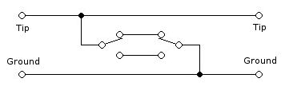

# 由升级零件制成的吉他静音踏板

> 原文：<https://hackaday.com/2015/01/08/guitar-mute-pedal-made-from-upcycled-parts/>

在你最喜欢的吉他上摇滚无疑是非常有趣的，但是无论你是在舞台上还是在地下室里演奏，快速地将那些致命的节奏静音是很方便的。[wozlaser]想要为他的吉他安装一个静音踏板,他决定自己做一个，而不是花几十美元买一个商业版本。

这个踏板是重型的，由金属制成。如果框架看起来很熟悉，那是因为在前世这是缝纫机的控制踏板。在旧货店找到的便宜货。内部零件取出后，他添加了几个关键部件。首先是 1/4”输入和输出插孔，是从一个旧的立体声系统。有一个 VCR 的瞬时开关和一个标准的吉他踏脚踏板开关安装在框架的前面。接线如下:

布线示意图非常简单，它只是接地和不接地的信号线。如前所述，有两个开关，一个瞬时开关和一个按下/推下开关。一个普通的静音踏板只有一个开关，但[wozlaser]想要一些特别的东西。如果将踏板踩到底，它将使信号静音或取消静音，直到再次踩下为止。当踏板处于弹簧支撑的“向上”位置时，一个控制杆会推动瞬时开关，轻轻推动踏板会使控制杆离开瞬时开关，从而使信号静音或取消静音。瞬时开关的功能(静音或取消静音)随着另一个开关的状态而变化。这与三向灯开关电路的工作原理完全相同，它允许两个开关控制你房子里的一盏灯。通过这种设置,[wozlaser]不仅可以使他的吉他静音和取消静音，还可以在关闭的情况下弹奏和弦，并随着音乐的节拍脉动和弦，或者利用一些吉他反馈轻敲踏板，使声音时隐时现。所有这些只需要花费[wozlaser]一点时间和备件…而且没有电池可以更换！