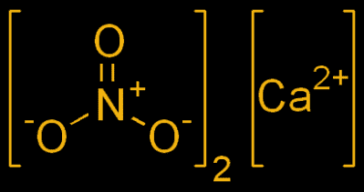

# 从尿液中提取火药，对抗一个怪物

> 原文：<https://hackaday.com/2015/06/15/gunpowder-from-urine-fighting-a-gorn/>

[科迪]在一个偏僻的地方有一个不错的小牧场，一支步枪，和一批弹药。这对僵尸启示录来说很好，但他没有无限的弹药供应。Z 日 20 年后，他可能会发现自己没有任何方法来保护自己。如何解决这个问题？他需要火药。你是怎么做的？这里有一个塑料罐。

制造火药需要三种成分——硝石、木炭和硫磺。如果你有树和像科迪这样的矿，最后两种成分很容易，但是硝石，硝酸盐的一种来源，在自然界中并不存在。如果你有足够的能量，你可以从大气中的氮制造硝酸盐，但是[科迪]在这个实验中使用了低技术。他把自己的尿液储存在堆肥堆里，也叫硝床。就像在塑料防水布上放几根草屑和稻草，在上面撒尿几个月，然后等着固氮做他们的事一样简单。

Calcium Nitrate

[科迪]不需要等待一年，他的堆肥堆变得硝酸盐饱和。他还有另一堆堆肥，已经堆了大约 18 个月，这对于提取硝酸钙的实验来说已经足够好了。浸泡并过滤掉这一点堆肥后，[科迪]剩下的是一种含有硝酸钙的溶液。这转化为硝酸钾-或硝石-通过运行它通过木灰。在弄干这些乱七八糟的液体后，[科迪]只剩下一些东西，加入一点碳就能燃烧。

有了硝石的来源，[科迪]只需要木炭和硫磺就可以制造火药。木炭很容易找到，而且科迪有一个硫化铅矿。他不能从矿石中提取硫，所以他用另一种催化剂——氧化铁红，或铁锈。

三种成分混合在一起，[科迪]决定是时候做个测试了。他有一把自制的火枪，或者一根一端焊有触孔的管子，还有一个大铅球。用他自制的火药，这支步枪真的能用。铅球不会飞很远，但足以在僵尸或鹿身上留下凹痕；对堆肥做的东西来说还不错。

从历史上看，这是一种非常奇怪的制造火药的方式。在历史上的大部分时间里，持枪者也有硝石的来源。然而，在拿破仑战争期间，法国不能进口火药或硝石，只能从士兵和牲畜身上收集尿液。这种硝酸盐的来源被收集起来，从硝酸钙转化为硝酸钾，并与木炭和硫磺混合用于野战部队。

尽管如此，[科迪]有一个很好的例子，说明使用传统方法可以做什么，他可以把球发射到桶里的事实足以证明他撒尿的硝石床会产生更好的火药。

[https://www.youtube.com/embed/8wW5KR1pDxs?version=3&rel=1&showsearch=0&showinfo=1&iv_load_policy=1&fs=1&hl=en-US&autohide=2&wmode=transparent](https://www.youtube.com/embed/8wW5KR1pDxs?version=3&rel=1&showsearch=0&showinfo=1&iv_load_policy=1&fs=1&hl=en-US&autohide=2&wmode=transparent)