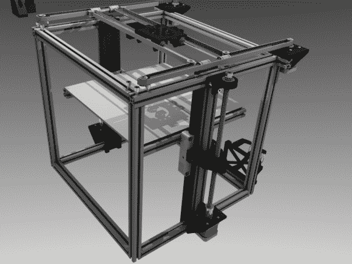

# H-bot 型 3D 打印机为 Z 轴移动床

> 原文：<https://hackaday.com/2013/04/05/h-bot-style-3d-printer-moves-bed-for-z-axis/>

[看看这个 3D 打印机](http://3d-printers.pl/projekty/hhot/h-bot-pierwszy-wydruk/) ( [翻译](http://translate.google.com/translate?sl=auto&tl=en&js=n&prev=_t&hl=en&ie=UTF-8&eotf=1&u=http%3A%2F%2F3d-printers.pl%2Fprojekty%2Fhhot%2Fh-bot-pierwszy-wydruk%2F))，这是【Arkadiusz pie wak】一直在做的。当提交关于他的项目的提示时，他做出了重要的区分，即它尚未完成，但他已经达到了他已经用它打印项目的临界阈值。

他决定采用一种有时被称为 H-bot 的设计。如果你完全不熟悉它，你可能会发现[这篇 H-bot 设计文章](http://www.edn.com/electronics-blogs/mechatronics-in-design/4368079/So-you-want-to-build-an-H-bot-)很有帮助。其要点是，这种技术使得用于沿 X 和 Y 轴移动挤出机的电机本身是固定的。一个大的定时(齿形)带在这个立方体的顶部形成了一个字母 h 形状的回路。这在[Arkadiusz]在跳跃后找到的渲染图像以及早期印刷测试的视频中更容易看到。

Z 轴使用安装在立方体底部的两个电机。这些提升和降低珠，而不是移动挤出机本身。打印机的最大尺寸应为 30x30x30 厘米。它由一个 [Smoothieboard](http://smoothieware.org/smoothieboard) 驱动，当[我们讨论将 RA 驱动板与 3D 打印机](http://hackaday.com/2012/07/10/ra-3d-printer-controller-board-does-everything-has-disco-lights/)一起使用时，它被提到了很多次。

[https://www.youtube.com/embed/edFl9tjkxFE?version=3&rel=1&showsearch=0&showinfo=1&iv_load_policy=1&fs=1&hl=en-US&autohide=2&wmode=transparent](https://www.youtube.com/embed/edFl9tjkxFE?version=3&rel=1&showsearch=0&showinfo=1&iv_load_policy=1&fs=1&hl=en-US&autohide=2&wmode=transparent)