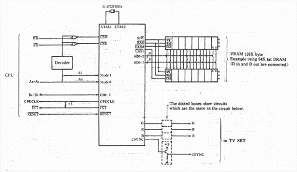
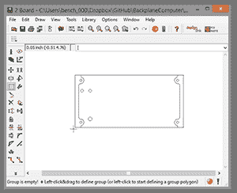

# Hackaday 68k:所以你想要一个工具包？

> 原文：<https://hackaday.com/2014/03/27/hackaday-68k-so-you-want-a-kit/>

这是对 [Hackaday 68k](http://hackaday.io/project/5-MC68000-Backplane-Computer) 的又一次更新，这种绕线背板计算机最终将服务于[我们的复古网站](http://retro.hackaday.com/)。

这也是一个 [Hackaday 项目](http://hackaday.io/)的演示，这是一个新的、花哨的在线文档工具，可以记录你所有的制作和修补冒险。你知道[我们正在举行一个黑客项目的比赛吗？制作一些科幻的东西，你就有可能获得一些真正的大奖。有焊接站，o-scopes，和许多其他奖品被扔给获胜者。太牛逼了。第一个造出能用的 Fusion 先生获胜。](http://hackaday.io/page/276)

在本次更新中，我将回顾视频板的起源，为什么 Hammond enclosures 同时令人敬畏和可怕，以及将它变成某种类型的套件或产品的一些想法。点击“阅读更多…”链接。

#### 视频板

就像我之前说过的，我用雅马哈 V9938 视频显示处理器作为这台电脑的图形芯片。这是我获得 80×24 文本模式的最简单的方法——完美地实现了那种*NIX 的美好——并且应该能够实现一些很酷的演示场景。它与 V9958 引脚兼容，因此我有这个选项，而且与计算机的其他部分接口也相当简单:

那是从 [V9938 技术资料书](ftp://ftp.whtech.com/Powertran%20Cortex/Documentation/V9938%20MSX%20Video%20Technical%20Data%20Book.pdf)上来的。巨大的 PDF 警告。该图的右侧是视频存储器的 DRAM 接口和视频输出引脚。有几种不同的配置，从 16k 的 VRAM 到 128k 的 VRAM。当然，我会选择 128k，使用我从 Jameco 获得的四个 TMS4464 DRAM 芯片。这是 VRAM 接口的原理图:

我不想用电线把它包起来。这是一大堆又细又短的电线。它也非常简单，在设计上不会有任何变化。解决我懒惰的办法当然是做 PCB。

因为到 V9938 的连接只是一个 8 位数据总线和几个控制信号，并且输出对于复合输出来说非常简单，所以这个*极大地*减少了我需要做的绕线量。即使我尝试缠绕 V9938，我也会遇到一个问题:引脚间距不是 0.1 英寸，导致我所有的绕线适配器都没有用。

如果你想知道电路板的物理尺寸，它只比 Arduino 大一点点。是的，我知道你在想什么，但是 128kB 的 V99X8 不适合标准的 Arduino shield。大概 16kB 吧。无论如何，当我拿回这些板时，我会试着用 Arduino 来驾驶它。只是因为。

* * *

#### 机械考虑

耶！花式视频！

[https://www.youtube.com/embed/dTjfzxB_OaQ?version=3&rel=1&showsearch=0&showinfo=1&iv_load_policy=1&fs=1&hl=en-US&autohide=2&wmode=transparent](https://www.youtube.com/embed/dTjfzxB_OaQ?version=3&rel=1&showsearch=0&showinfo=1&iv_load_policy=1&fs=1&hl=en-US&autohide=2&wmode=transparent)

我从未在哈蒙德附件上有过任何运气。压铸铝吉他踏板？我已经毁了几十个钻孔的罐子，开关和插孔。68k 的机箱也不例外。毫无疑问，这是一个美丽的案例，但我被一种神秘的能力所诅咒，当涉及到哈蒙德围栏时，我总是搞砸钻孔、绘画或一些随机的事情。

这种背板+外壳组合的最初计划是在前面有一个小的扩展板(因此，“前板”)，断开电源和复位线，这样这台计算机至少看起来像 80 年代早期的自制计算机的一部分。此外，在外壳的外面的*上有一个电源和复位开关也是一个好主意。*

由于我的“前面板”计划彻底失败，我打算买一个更酷的东西:定制的 CNC 铝制面板。现在我有一个电源开关，一个复位按钮和一个 5 毫米的 LED 电源指示孔。

这个前板的基本电路非常简单:背板上的线路在一个巨大的 2×32 引脚接头上断开。还有一个小的三针接头，用于 ATX 电源的 PS_ON 和 POWER_OK 线。用开关把 PS_ON 线接地，电源……嗯，开了。当电源接通时，PS_ON 线路提供+5V。把 LED 接到那上面。

复位电路与 CPU 板相同:Maxim DS1812 监控和复位电路采用单个 TO-92 封装。

创建铣削前面板和新的，改进的前面板是一个有趣的机械设计练习。首先，我将前面板创建为 3D 模型，将顶视图导出为 DXF，并将其导入 Eagle。然后，我采取了背板板文件和覆盖孔。然后，只需简单地从背板上移除我不需要的零件和走线——除了引脚接头之外的一切——并制作电路板。

Apparently the Dimension layer in Eagle has a keepout. This board is far too simple for me to care about doing it properly.

所以你走吧。混合机械设计和电路板制作的有趣冒险。就像其他与 68k 项目相关的东西一样，[在 github](https://github.com/bbenchoff/BackplaneComputer/tree/master/Enclosure) 上发布。

#### 哦，对了，一套工具

出于某种我无法理解的原因，很多人问我是否会把 68k 做成一个产品，或者至少是一个套件。不太懂需求；自制电脑的乐趣在于设计和制造它们。

这并不意味着我不会考虑这个想法。然而，以目前的形式，68k 的套件会贵得离谱，需要数小时的组装时间——仅 RAM 卡就需要三四个小时——而且会有大量不满意的买家。你知道，只要一根放错地方的线就能把整个事情搞砸。

因此，改进的单 PCB 套件是唯一的选择。这是几个月以后的事了，但我是这么想的:

*   使用当前生产的 68SEC000
*   已经组装好了。
*   MiniITX 或 MicroATX 主板外形。
*   RAM 使用 30 或 72 引脚 SIMMs。
*   某种扩展端口。
*   用户可更新的 ROM。

最后一颗子弹是症结所在。这件事我已经考虑了一段时间了，但我想不出一个好办法来做这件事。问题是我需要少量(约 64kB)的 EEPROM 或 Flash，可以通过并行总线访问。这意味着 15 条地址线、16 条数据线和控制信号。我需要一种重新编程的方法，在系统中，用很少的额外部件，便宜。

显而易见的解决方案是在系统中加入一个大型 FPGA，用于地址解码、SPI 总线和 ROM 的系统内重新编程。这可能是这个问题的最终解决方案，但我认为有一种更聪明、更便宜的方法。

我曾在一台基于 6502 的逆向计算机上摆弄过整个“系统 ROM 重新编程”的事情，通过使用一个微控制器和一堆移位寄存器对 ROM 进行编程是可能的。这占用了大量的电路板空间，而且非常笨重。

另一个解决方案是类似于[这个神奇的反计算机](http://hackaday.com/2014/02/12/the-three-chip-retrocomputer/)的东西，实际上*应该*是一个产品。它使用 40 针 PIC 微控制器作为 RAM、ROM 和 ACIA。毫无疑问，这是过去几年中逆向计算领域最具创新性的项目，并为系统内 ROM 编程问题提供了一个有趣的解决方案:只需将 ROM 放在一个大的微控制器上。

这些想法中有哪个是正确的解决方案吗？我不知道，因为我现在没有把这台电脑设计成一个产品。这个问题困扰我有一段时间了，很想听听更多的想法。无论如何，我的 ROM 板上有足够的空间来原型化一些系统内重新编程。想出一个好主意，我可能会把它放进去。

* * *

暂时就这样了。你可以继续关注 Hackaday 项目的进展。一定要评论，给项目一个脑瓜。说真的，给这个项目一个脑壳。我正在输给[【马修】在头骨部门的 Mooltipass 项目](http://hackaday.io/project/86-Mooltipass)。我需要更多的头骨。