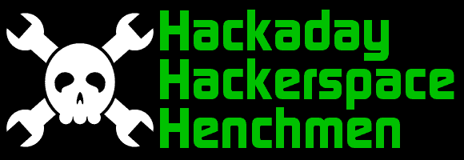

# 给你免费的东西

> 原文：<https://hackaday.com/2013/10/07/hackaday-hackerspace-henchmen-equals-free-stuff-for-you/>

你是当地黑客空间的成员吗？你想要一些免费的东西吗？那么你需要成为 Hackaday Hackerspace 的追随者之一。

黑客空间是一个神奇的地方，充满了聪明的人，他们能做出令人愉快的黑客行为。但通常外界并不了解他们。当一个成员完成一个项目时，他们会把它展示给其他成员看，这样就消除了分享这种美妙感觉的需要，也让他们摆脱了通常会促使某人发布相关帖子的动力。我们想知道你在你的黑客空间都做了些什么，公开它将有助于在黑客空间之间分享想法。请将详细信息发送给我们，我们会以一些奖品作为回报，并为最例外的黑客提供一些特殊奖励。请继续阅读奖品详情以及这一切将如何运作。

首先是奖品:我们计划向每一个合格的参赛作品发送 Hackaday 贴纸。我们将挑选最多五名优秀的参赛者，他们将因为分享他们的黑客技术而获得 Hackaday T 恤。将有一名优胜者获得一张价值 50 美元的礼品卡，送给他们选择的零件供应商。

每次我们呼吁 Hackaday Hackerspace 党羽提交时，我们都会宣布一个主题。你需要把一些图片和对黑客的描述放在一起(它的开始，构建过程，以及什么有效什么无效)。我们将使用这些在我们的首页上突出更好的条目。如果你已经写了很多关于这个项目的东西，那就很好。我们仍然希望你告诉我们你的故事，就像你站在黑客空间和你的朋友聊天一样。这种体验是我们认为最有趣的。如果你想制作一个视频，很好——请把它发布到你最喜欢的托管服务(YouTube 等)上。)并将该链接以及您可能有的任何其他参考链接发送给我们。

谁会赢？Hackaday 的编辑和作家将最终决定谁能得到 t 恤，谁能得到礼品卡。我们将根据黑客本身、您发送给我们的信息的质量以及我们首页上发布的功能的受欢迎程度来做出决定。高度鼓励迎合；-)

### 当前主题和参赛截止日期

主题是最激进的机床黑客。对黑客空间来说，最大的吸引力之一是机械商店。你有没有一个大得要炸开一面墙才能把它放在大楼里的磨？数控改造/更换怎么样？任何与机床相关的黑客都是游戏。

您必须在 10 月 31 日之前将您的意见提交给我们。将根据完整性对它们进行评判(你是否讲述了整个故事，并给我们发了一些相关图片？)、黑客本身的独创性/努力以及帖子在黑客日读者中的受欢迎程度。入围名单将于 11 月 11 日公布。

不言而喻，黑客作家/编辑、SupplyFrame 员工及其亲属没有资格获奖。