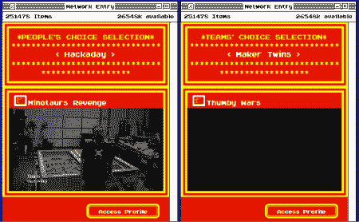

# hackaday 在红牛反应大赛中获得了第一名！

> 原文：<https://hackaday.com/2012/08/01/hackaday-has-won-1st-place-in-the-redbull-creation-contest/>

人民已经说话了。Hackaday 通过大众投票赢得了红牛创造挑战赛。尽管投票过程中有一些坎坷，我们的项目[牛头怪的复仇](http://hackaday.com/2012/07/28/the-minotaurs-revenge-dueling-labyrinths/)(视频中大约 2 分钟的游戏片段)获得了最多的公众投票，赢得了 5000 美元的黑客空间和一次去纽约[世界创客日的旅行](http://makerfaire.com/newyork/2012/index.html)。

感谢所有能够投票的人，我们完全理解那些没有投票的人。