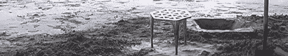
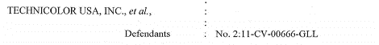
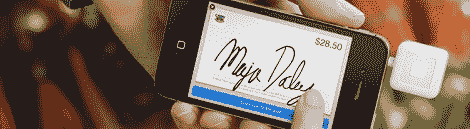

# 黑客日链接:2012 年 4 月 18 日

> 原文：<https://hackaday.com/2012/04/18/hackaday-links-april-18-2012/>

#### 沙滩沙盘游戏

[mkb]发来一段他发现的视频，是关于[Max Lamb] [在英格兰的一个海滩上用沙盘投掷凳子](http://vimeo.com/9498805)的。材料是白镴，或者说> 90%的锡，外加一点铜和锑。虽然我们肯定会有一些环保主义者的抱怨，但这仍然是一个很酷的视频。

#### 你的项目需要一个有机发光二极管展示

这里有一个 Kickstarter 为一个微小的 96×16 有机发光二极管显示器。把这个东西连接到任何一辆 I2C 公共汽车上，你就能非常容易地得到一个 15×2 字符显示器(或者一个图形显示器，如果你愿意的话)。感谢[Chris]发送这封邮件。

#### 这是给 larf 的

瑞安·因曼正在起诉 20 家公司，因为他在真空管中汞中毒。再读一遍最后一行。大多数出售古董/再生/难以找到的组件的公司，如安吉拉仪器，古董电子供应，甚至易贝都被列为本案的被告。这可能会让至少[一家公司倒闭](http://www.cascadesurplus.com/lawsuit/) ~~尽管他们从未卖给【瑞安】一个真空管~~编辑:他们*卖给了*一个霓虹灯，当涉及到技术问题时，法院通常是白痴。这很搞笑也很悲伤，所以如果我们得到更多的信息，我们会及时通知你。

#### 怀旧，旧伤带来的痛苦

Adafruit 博客[在苹果游戏*洛基的靴子*上发布了一个优秀的作品](http://www.adafruit.com/blog/2012/04/16/learn-about-electronics-by-playing-games-rockys-boots/)，这是一个 1982 年的教育游戏，教孩子们如何连接逻辑门。你可以在你的浏览器中玩这个游戏[，但是我们想听听我们的古代视频游戏的故事，这些游戏教你工程学概念，比如](http://www.virtualapple.org/rockysboots.html)[不可思议的机器](http://en.wikipedia.org/wiki/The_Incredible_Machine_(series))或者[小部件工作室](http://en.wikipedia.org/wiki/Widget_Workshop)。如果我们遗漏了什么，请在评论中留言。

#### 向社区提出的问题

一家公司正在赠送插入设备耳机插孔的信用卡读卡器。[J . Smith]写信来问我们是否有人得到了其中的一个并打开了它们。像[J Smith]一样，我们期待着 CueCat 的[重演，免费硬件向所有人开放。如果你已经拆了其中一个读卡器，](http://hackaday.com/2005/06/12/cuecat-hacking/)[在](http://hackaday.com/contact-hack-a-day/)发送它。

#### 3DS 自制软件

[Mike]给我们发了一个链接，链接到[[neimod]的 Flickr 照片流](http://www.flickr.com/photos/neimod)。看起来我们正处于撕开任天堂 3DS 自制软件的风口浪尖。使用[这么多热熔胶](http://www.flickr.com/photos/neimod/6487818901/in/photostream)的人一定知道他们在做什么，对吗？