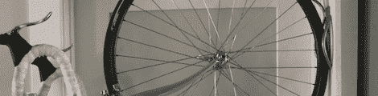

# 黑客日链接:2012 年 8 月 3 日

> 原文：<https://hackaday.com/2012/08/03/hackaday-links-august-3-2012/>

#### 哦，酷，我们出名了

#### 

上周末，特伦特河畔斯托克的[科技团队电台节目](http://www.6towns.co.uk/)采访了我们的老板【Caleb】。这是一次非常精彩的采访，我这么说不是因为[Caleb]签了我的支票。整个节目都在 Mixcloud 上[播出，你可以听大约 20 分钟的采访。顺便说一句，采访[Caleb]的人现在为我们写文章。请欢迎[理查德]加入我们的杂牌军。](http://www.mixcloud.com/6TownsRadioTechTeam/6-towns-radio-tech-team-show-29-07-12/)

#### 团购是个很棒的主意

我们之前已经看过几次为你的电子项目设计的 Etsy。[emile] [发布了一篇博客文章](https://tindie.com/blog/1-month-liveand-1-more-thing/)，展示了第一个月令人印象深刻的统计数据:646 美元归制造商所有，近 29000 次独立浏览量。[emile]正在做一个叫做 Starter 的新项目。这一功能使制造商能够衡量人们对其项目的兴趣，并为稀有和深奥的组件组织团购。我们迫不及待地想看到这一功能上线，当然，当它上线时，我们会为它插上一脚。

#### 先是丁丁，现在修好了

[Adam]需要一种方法来存放他的自行车，所以他做了一个[摇摆壁挂支架](//derwiki.tumblr.com/post/28293967759/diy-swinging-urban-bike-rack)来固定。支架用螺栓固定在门框上，因为它可以摆动，所以不会碍事。

#### 橡皮布技术的最新进展

在奥运会开幕式上，[schobi]看到了一些非常酷的发光毯。从这张照片来看，这些毯子看起来真的在发光，但是我们不知道这是怎么做到的。有人知道这种效果是如何产生的吗？

#### *咳嗽*树莓*咳嗽*

[Craig]需要一种没有任何安装孔的 PCB 安装方法。他拿出了一个激光切割的 Delrin 夹子，并把文件放在了 Thingiverse 上。