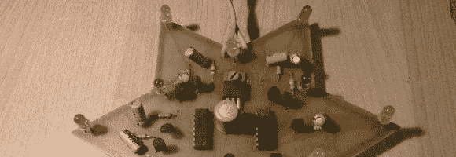
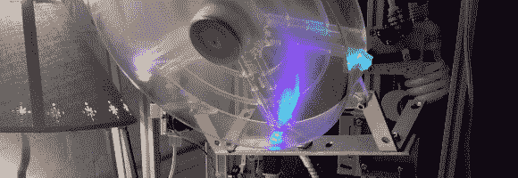
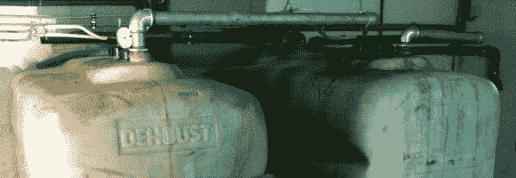
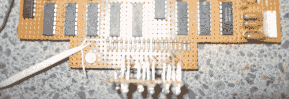

# 黑客日链接:2013 年 2 月 9 日

> 原文：<https://hackaday.com/2013/02/09/hackaday-links-february-9th-2013/>

【1982 年的爱好电子

[Lennart]偶然发现了他几十年前的一个项目。它是[一颗闪烁的星星，使用一些 7400 逻辑芯片和 RC 定时器以不同的速率闪烁 LEDs】。](http://lell.se/hacks/star/)

**焊烟提取器**

我们仍然用嘴吹走焊接烟雾，但这可能会激发我们去做别的事情。这是一个安装在灯鹅颈上的大型电脑风扇。它夹在长凳上，很容易定位。

**超声波液位测量**

想要在不淹没传感器的情况下测量这些储罐中的液体，[JO3RI]求助于[Arduino 和超声波测距仪](http://www.jo3ri.be/arduino/blogduino/arduinodualtanklevelmeasuringhasbeenupdated)。他的方法甚至允许水平被绘制成图，如[他的项目说明](http://www.instructables.com/id/Arduino-dual-ultrasonic-liquid-level-meter-with-in/)所示。

**增加一个“开”灯以节省电池**

翻垃圾箱找到了这台电子鼓给[ms 3 fgx]的女儿玩。问题是，按下任何一个按钮都会打开它，它没有自动关闭功能，也没有办法知道它什么时候打开。这是不可接受的，因为它靠 5 节 AA 电池运行。他的[快速修复增加了 LED](http://www.digifail.com/hacks/drumled.shtml) 上的绿色。我们想知道他是否会在此基础上改进并增加自动关机功能？

**CMOS 二进制时钟**

这是 2000 年初[Dennis'] [CMOS 二进制时钟项目](http://www.projectlocker.ca/otherentry.php?id=4)的一部分。他甚至制作了一个漂亮的盒子，上面有一个 led 窗口，你可以看到它垂直安装在原型板上。