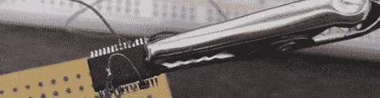
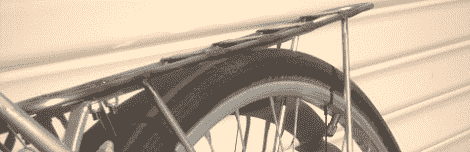
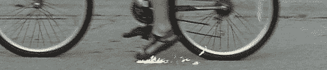

# 黑客日链接:2012 年 7 月 13 日

> 原文：<https://hackaday.com/2012/07/13/hackaday-links-july-13-2012/>

#### 测试 led

在阿尔伯克基，NM hackerspace Quelab，[Alfred]需要测试一堆表面贴装 led。他最终[制造了一对 3D 打印镊子](http://quelab.net/wordpress/1475/behold-quelabs-newest-tool/)，末端附有一对针，还有一个空间用于放置硬币电池。它成功了，奎拉布有了新的工具。

#### Woo 树莓派

在他的 Raspberry Pi 上添加了一个 FTDI 芯片来做一点单电缆开发。我们已经看到了一些类似的构建，但令人惊讶的是，没有任何与板载显示器串行接口相关的内容。[这个维基页面](http://elinux.org/RPi_Screens#Interfacing_to_non-monitor_LCD_panels)建议~~可以将 iPhone 3G 或 iPhone 4 显示器直接连接到 Raspi。有人想试试吗？没关系，但如果能从 Raspi 的显示器接口上获取图片，那就太棒了。~~

#### 我喜欢骑自行车，我喜欢骑自行车

#### 

在 23b hackerspace，一些人很难找到一个价格合理的自行车货架。他们用 30 美元的材料和一个回收的牛奶箱建造了自己的。它看起来很棒，而且很可能比沃尔玛的型号更耐用。

#### 如果那个货架掉下来，它会像这样

Apparently you can get ‘spark cartridges’ to attach to the underside of a skateboard. [Jim] saw these would look really cool attached to his bike so [he did the next best thing](http://www.instructables.com/id/Bicycle-Spark-Shooting-Technique/). He attached them to his sandals. It *does *look cool…

#### 热量更少，噪音更小

[YO2LDK]拿起一个用于软件无线电的电视调谐器加密狗，[发现它过热，大约 15 分钟后停止工作](http://yo2ldk.blogspot.ro/2012/07/rtl2832-dvb-t-mods-micsorarea.html)(罗马尼亚语，[谷歌翻译](http://translate.google.com/translate?sl=ro&tl=en&js=n&prev=_t&hl=en&ie=UTF-8&layout=2&eotf=1&u=http%3A%2F%2Fyo2ldk.blogspot.ro%2F2012%2F07%2Frtl2832-dvb-t-mods-micsorarea.html&act=url))。他用一个旧显卡改装了一个散热器来解决这个问题。额外收获:噪音降低了零点几分贝。