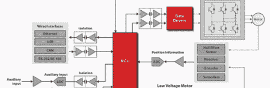
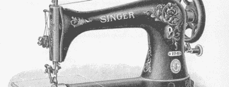

# 黑客日链接:2012 年 7 月 25 日

> 原文：<https://hackaday.com/2012/07/25/hackaday-links-july-25-2012/>

#### 想知道 CPU 开发板是什么样子吗？

在高度机密的硬件领域，没有比英特尔即将推出的 CPU 更机密的了。不知何故，一些 CPU 开发板在易贝上了发条，而[Leon]酷到足以[保存所有图片](http://leon-instruments.blogspot.com/2012/07/kolekcja-prototypy-procesorow.html)(波兰语、[谷歌翻译](http://translate.google.com/translate?sl=pl&tl=en&js=n&prev=_t&hl=en&ie=UTF-8&layout=2&eotf=1&u=http%3A%2F%2Fleon-instruments.blogspot.com%2F2012%2F07%2Fkolekcja-prototypy-procesorow.html&act=url)，或者在侧边栏中翻译)。现在[有一些正在进行的拍卖](http://www.ebay.com/itm/Intel-Confidential-CPU-Development-TY56ANF012-/250970887760?pt=LH_DefaultDomain_0&hash=item3a6f07d650&_uhb=1#ht_1442wt_916)，但是我们会解决这个 LGA 1156 分线板的[。太酷了。](http://www.ebay.com/itm/Very-Rare-Intel-Pentium-P55C-Testing-Fixture-Intel-Confidential-/261064829590?pt=LH_DefaultDomain_0&hash=item3cc8ad2a96&_uhb=1#ht_2380wt_1150)

#### 不，我们没有将*直接*链接到免费内容

TI 将赠送由 Stellaris ARM 处理器驱动的无刷电机控制器。[Chris]他说他正在订购一个产品，以了解如何用赠品制作 Stellaris 开发板。这个控制器是为电动自行车设计的，所以至少我们可以在未来看到一些巨型无人机。

#### 更多火箭的东西！

[比尔]的一个老员工拿着一个 [CVS 一次性数码相机](http://hackaday.com/2006/07/24/cvs-camera-software-unlock/)(还记得吗？)并把它塞进一枚[埃斯蒂斯 D 动力火箭](http://www.rocketreviews.com/estes-industries-x-prize-canadian-arrow--by-john-brandon-iii.html)的机头代码中。[YouTube 上有大量[比尔]的飞行视频](http://www.youtube.com/playlist?list=PLE3564E230E3B60B4&feature=plcp)。

另一方面，[赛博朋克]建造了一个摇摆翼火箭发射滑翔机的半比例模型(图片: [1](http://hackaday.com/wp-content/uploads/2012/07/hpim1338.jpghttp://hackaday.com/wp-content/uploads/2012/07/hpim1338.jpg) 、 [2](http://hackaday.com/wp-content/uploads/2012/07/hpim1333.jpg) 、 [3](http://hackaday.com/wp-content/uploads/2012/07/hpim1331.jpg) 、 [4](http://hackaday.com/wp-content/uploads/2012/07/hpim1329.jpg) )。他目前正在建造能够携带遥控和视频设备的全尺寸版本，并希望获得一些反馈。

#### 平板电脑上的 CAD？

[spuder]听到了一些人正在开发的基于平板电脑的工程笔记本的风声。他们希望得到一些关于他们演示视频的反馈。我们认为这很酷——尤其是在设备之间共享东西的能力——但是平板电脑上的 CAD 让我们*非常*怀疑。告诉他们你的想法；我们很乐意看到它出现在我们的手机上。

#### 现在，如果他们只为编辑 WordPress 帖子做一个…

测试驱动开发变得更酷了。这里有一个为 Eclipse 准备的[电子鸡，你可以通过从红色变成绿色并重构你的代码来“喂养”它。要小心，因为两次进行与 red 相同的代码测试会杀死你的小代码忍者。](http://www.happyprog.com/tdgotchi/)

#### 现在我要对你咆哮了。

前几天我贴了【Becky Stern】的点亮[车把项目](http://hackaday.com/2012/07/21/diy-globars-for-nighttime-bike-visibility)，[一条评论](http://hackaday.com/2012/07/21/diy-globars-for-nighttime-bike-visibility/#comment-709106)让我大吃一惊。谁说男生不会缝纫？是时候面对项目中使用缝纫时出现的性别角色了。我正在做一个如何缝制降落伞的教程，但是我需要你的帮助。这将分为两部分:一部分讲述如何实际使用缝纫机，另一部分讲述如何制作“滑槽”。你还想看别的什么吗？