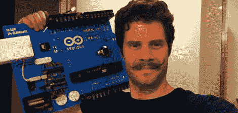
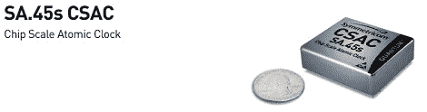
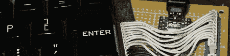

# 黑客日链接:2012 年 6 月 12 日

> 原文：<https://hackaday.com/2012/06/12/hackaday-links-june-12-2012/>

#### 在*实时*呈现惊人的 3D 效果

啊，90 年代。一个简单得多的时间，当主持人的坏影响！SGI Onyx RealityEngine2 的 3D 渲染能力令我们惊叹不已。这台[巨型机器](http://hardware.majix.org/computers/sgi.onyx/onyx.shtml)当年花了 25 万英镑，这是一笔惊人的数目，但话说回来，我们开始怀念旧的 SGI 硬件了。

#### 嗯，Mega 被占用了…就叫它 Grande 吧

[约翰·派克]需要为上个月的创造者大会做些准备。一个滑稽的大，功能齐全的 Arduino 是显而易见的选择。如果你没有赶上上个月的[演示，你可以在 Thingiverse](http://makerfaire.com/pub/e/8185) 上抓取[的所有文件。](http://www.thingiverse.com/thing:24225)

#### 你口袋里的是原子钟还是…哦，我明白了。

这是世界上最小的原子钟。它是为军事硬件制造的，所以不要指望这东西会很快在 Sparkfun 上出现；我们甚至不知道这东西到底值多少钱。然而，当这项技术在 10 年或 20 年后惠及消费者时，它将是令人敬畏的。

#### 将 TRS-80 键盘转换为 USB

[Karl]正在做一个很棒的项目——在一辆旧的 TRS-80 里放一个树莓派。该项目的第一部分——将 TRS-80 键盘转换成 USB 接口——已经完成。我们迫不及待地想看到这个建筑完工。

#### DIY 螺旋桨开发板

上周[我们抱怨](http://hackaday.com/2012/06/08/building-a-1980s-microcomputer-with-a-parallax-propeller/)缺乏使用视差推进器的构建。一些高贵的修补匠响应了我们的号召，用这种真正独特的微处理器做了一些令人敬畏的构建。[Stefan]的[推进器一号](http://diy-2010.net/community/2010/12/29/propeller-one/)是最新的，看示意图应该可以为这个项目蚀刻一个单面电路板。出色的工作和感谢给我们一个周末项目，[斯特凡]。