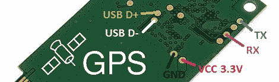
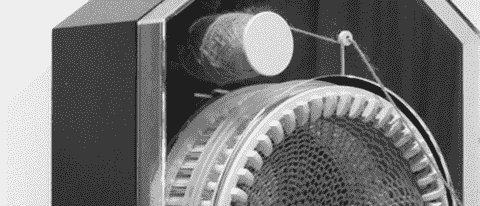
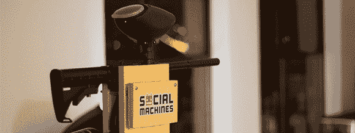

# 黑客日链接:2013 年 3 月 8 日

> 原文：<https://hackaday.com/2013/03/08/hackaday-links-march-8-2013/>

#### 廉价的 GPS 模块

如果你正在做一个启用 GPS 的项目，你可能已经注意到普遍可用的 GPS 模块相当昂贵——通常在 50 美元左右。这里有一个 8 美元的。这是 PCI Express 卡上的 U-blox PCI-5S GPS 接收器。不过，串行和 USB 数据有测试点，因此在您的项目中安装这些测试点轻而易举。

#### 落地钟做了一条长颈鹿的围巾

[这里有一个来自【塞壬伊利斯·威廉森】](http://collectiftextile.com/?p=6562)的时钟项目。在 365 天的过程中，时钟编织了一个巨大的 2 米长的纱管，这应该是半打袜子的完美开端。没有这方面的视频，但如果你找到一个，发表评论。

#### Hotlanta 的巨大黑客空间

亚特兰大有了新的黑客空间。它叫做我的发明家俱乐部，他们开始进入他们的空间。从[【史考特】的新空间照片](http://store.curiousinventor.com/blog/myinventors_club_coming_to_atlanta/)来看，它很大。他们一搬进来，我们就迫不及待地想参观视频了。

#### Ardino 和 Windows 8

windows 8……很奇怪……而且你不可能在没有很多废话的情况下安装未签名的驱动程序。这意味着安装 Arduino IDE 很痛苦，但是[【Dany】有一个解决方案](http://www.danyo.ca/arduino-drivers-on-windows-8/)。重新启动进入“测试模式”,你可以安装未签名的驱动程序，而你的计算机不会发出一声嘶吼。

#### 关于伤痕和瘀伤的推特

[扎克]的老板告诉他拿出一个 Twitter 控制的彩弹枪。我们不知道他为什么被要求建造这个，但是这个建筑仍然很酷。它由 Arduino 驱动，仅用 12 小时就建成了。要是有视频流就好了…

#### 嘿伙计们，这里需要帮助。

好吧，我在部件采购上有点小问题。我在为树莓派做一个“盾牌”。有人知道我在哪里可以得到真正长的 GPIO 引脚母头，使董事会将适合在 USB 和以太网插孔？如果你好奇的话，这里有一个项目。我认为头部的凹入部分至少需要 14 毫米高，以适合 USB 端口。

编辑:Samtec ESQ-113-33-L-D. [这是他们的网站](https://www.samtec.com/)。这个网站太棒了。你实际上可以…找到东西。完全独特的体验。谢谢你，理查德。