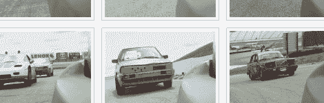
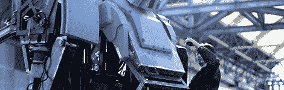
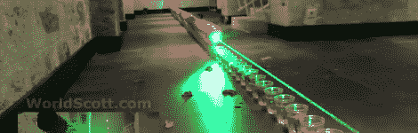
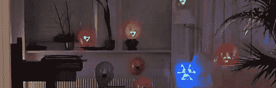

# 黑客日链接 2012 年 5 月 13 日

> 原文：<https://hackaday.com/2012/05/13/hackaday-links-may-13th-2012/>

**惊人的屁股…对于一个机器人来说**

是的，日本仍然垄断着令人毛骨悚然的机器人市场。典型的例子是[这个机器人的后部](http://www.youtube.com/watch?v=vhHo6CUq4-o)。别担心，他们包括一个解剖，所以你也可以看到内部是如何工作的。[via [Gizmodo](http://gizmodo.com/5909164/the-most-realistic-robotic-ass-ever-made)

**延时相机模块结果**

****

 **正如承诺的那样，[奎因·邓基]从她的延时相机模块发送了一个指向[相册的链接。如果你错过了，她](https://www.facebook.com/media/set/?set=a.10150864209929586.429880.68033379585&type=1)[在井字游戏容器](http://hackaday.com/2012/03/29/808-camera-hack-produces-a-time-lapse-tic-tac-box/)中制作了它，并把它贴在赛车的侧面。

**Kinect 控制的 killbot**

我们没有从机械战警身上学到什么吗？我们完全可以看到[这个 Kinect 控制的机器人](http://www.youtube.com/watch?v=rT0OhCDBsGs)(碰巧重达五吨)失去控制，液化了站在它旁边的一部毫无防备的电影。[via [Dvice](http://dvice.com/archives/2012/05/kinect-controll-2.php)

**激光弹出多米诺气球**

显然[斯科特]用激光爆开一排 100 个红色气球创造了一项世界纪录。我们喜欢看到 1W 的激光器发出爆裂声……用不了多久，我们就会拥有手持式激光手枪。[via [Gizmodo](http://gizmodo.com/5909007/we-hope-lasers-popping-hundreds-of-balloons-is-the-new-dominos-fad)

**激光气球瞄准**

如果最后一个有点令人失望，你可能会更喜欢这个自动瞄准系统。蓝色的三角形图标正在设定目标，琥珀色的三角形已经被设定为目标。一旦所有的气球都被识别出来，一束激光会迅速按顺序射向每一个气球。相当令人印象深刻，虽然没有提供细节。[感谢所有发送此链接的人]

[http://gizmodo . com/5909007/we-hope-lasers-popping-the-new-dominos-fad](http://gizmodo.com/5909007/we-hope-lasers-popping-hundreds-of-balloons-is-the-new-dominos-fad)**