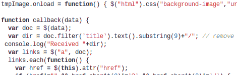
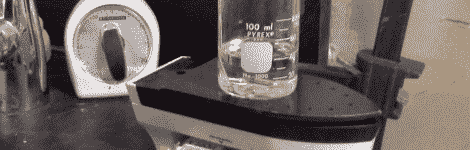
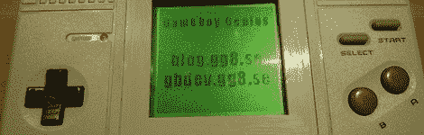

# 黑客日链接:2012 年 11 月 15 日

> 原文：<https://hackaday.com/2012/11/15/hackaday-links-november-15-2012/>

**另一种拆卸双销头的方法**

【Uwe】来信分享了[他拆卸双销接头](https://uwe-arzt.de/20120613.html)的技术。他使用两个单插脚插头、一块原型板和一个双排插脚插座来制作适配器。这是可移除的，而[我们本周看到的另一个方法](http://hackaday.com/2012/11/13/make-dual-pin-header-footprints-into-breadboard-friendly-dip/)不是。

**基于网络的幻灯片放映黑客**

想要使用旧的 Android 平板电脑作为数码相框，【Gordon】编写了一个简单的方法[使用 HTML 页面扫描你的图片目录，以提供旋转的背景图像](https://github.com/gfwilliams/SingleFileSlideshow)。

**最简单的热板**

在他的化学实验中，查理用一个普通的旧衣服熨斗来加热盘子。他只是把它倒过来夹在长凳上。它没有任何搅拌能力，但我们在商店里已经有一个旧熨斗，我们用它来转移墨粉，所以如果我们需要加热化学品，我们必须记住这一点(这可能是一种加热蚀刻剂的好方法)。

**一个充电 VU 计**

这款 Cambrionix series8 通用充电器具有多列 led，当设备充电时，这些 led 会亮起。[史蒂夫·泰森]为该公司工作，并从摆弄固件中获得了一些乐趣。他正在展示作为 VU 仪表的显示屏。

**Game Boy 山寨拆解**

当最初的系统上市时，这种宽外形的游戏机是一种仿制品。你不会想错过这篇看一看里面有什么的长篇文章。[谢谢尼尔]