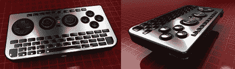
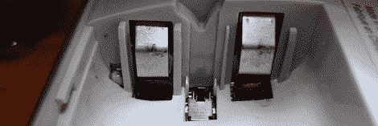
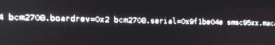
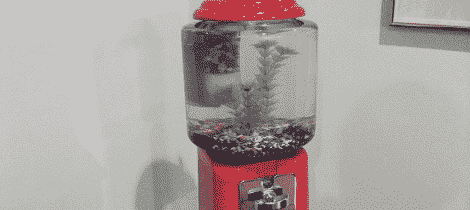

# 黑客日链接:2012 年 9 月 15 日

> 原文：<https://hackaday.com/2012/09/15/hackaday-links-sept-15-2012/>

#### 非常小的键盘

iControlPad2 背后的想法非常简单——只需从手机中取出滑出式键盘，丢弃手机部分，添加两个模拟棒和一个 D-pad，并在其中安装蓝牙。这是一个非常小的键盘，非常适合控制 Raspi、家庭媒体服务器，甚至是手机或平板电脑。[反正我觉得](http://www.kickstarter.com/profile/2141746332)很酷。

#### 我问你一个问题。夏威夷衬衫在哪里？

在她当地的黑客空间里，[Akki]听到有人把 Raspberry Pi 发音为“树莓尿眼”当然，这个笑话需要发挥到极致，所以[Akki] [给了她一个[汤姆·塞立克]胡子。比](http://excitedmakingshinythings.blogspot.co.uk/2012/09/raspberry-pi.html)[略胜一筹的是瞪着眼睛的阿杜诺盾牌](http://www.evilmadscientist.com/2011/the-googly-eye-shield-for-arduino/)。

#### 对专利电池不感兴趣

当给翻转摄像机供电时，[丹]有两种选择:普通 AA 电池，或通过 USB 端口充电的专有电池。当插入可充电电池时，它会关闭一个小开关，告诉翻盖可以给这些电池充电。想要把自己的充电电池放进相机里，[Dan] [用一点点纸板](http://blog.danjoannis.com/?p=1062)合上开关，这样就可以让他使用自己的镍氢充电电池了。

#### 从头开始构建操作系统

不久前，我们发布了一篇关于剑桥教授在树莓 Pi 上从头开始开发操作系统的教程。[乔伊] [决定跟随这些教程](http://joeyos-raspi.blogspot.com/)，并有一个博客专门记录他在操作系统开发中的冒险经历。这还不是一个定制的 UNIX 风格的操作系统*。*

#### 放入 25 美分硬币，得到一条金鱼

Reddit 上的 Yooder 花了一周时间把口香糖贩卖机变成了鱼缸。一个非常漂亮的建筑，现在是几个霓虹灯四重奏的家。查看[imgur 相册](http://imgur.com/a/sDQMP)获得完整的构建演练。